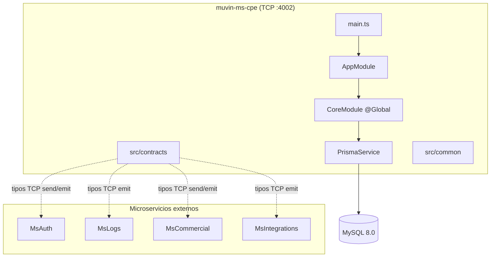

# muvin-ms-cpe (ms-documentation)

> **Stack:** NestJS v11 · TypeScript v5.9 · Prisma v6 · MySQL 8.0 · TCP Microservice
> **Versión:** 0.0.1
> **Última revisión:** 2026-04-27
> **Estado:** Base estructural implementada — sin módulos de dominio aún

---

> [!info] Propósito del proyecto
> `muvin-ms-cpe` es un microservicio del ecosistema **Muvin / BCR** que comunica vía TCP con otros microservicios (`MsAuth`, `MsLogs`, `MsCommercial`, `MsIntegrations`). Provee la base estructural (configuración, contratos, infraestructura de datos) lista para implementar funcionalidades de dominio. Actualmente en estado inicial: el esquema de base de datos y los handlers de mensajes están pendientes de implementación.

---

## Módulos principales

| # | Módulo | Descripción | Criticidad | Enlace |
|---|--------|-------------|:----------:|--------|
| 1 | AppModule | Módulo raíz ensamblador | 🟡 | [[modulo-app]] |
| 2 | CoreModule | Infraestructura global (Prisma, repositorios) | 🔴 | [[modulo-core]] |
| 3 | contracts | SDK de tipos inter-microservicios | 🔴 | [[modulo-contracts]] |
| 4 | common | Utilidades (logging, respuestas, CMDs) | 🟡 | [[modulo-common]] |
| 5 | config | Configuración y validación de entorno | 🔴 | [[modulo-config]] |

---

## Arquitectura de alto nivel

---

## Índices rápidos

| Inventario | Enlace |
|------------|--------|
| Árbol de archivos | [[tree-estructura-archivos]] |
| Stack tecnológico | [[stack-tecnologico]] |
| Clasificación funcional | [[functional-classification]] |
| Dependencias entre módulos | [[cross-module-dependencies]] |
| Matriz de dependencias | [[depends-matrix]] |
| Dependencias core vs. custom | [[core-vs-custom-dependencies]] |
| Inventario de seguridad | [[security-inventory]] |
| Índice de archivos de datos | [[data-files-index]] |
| Deuda técnica | [[deuda-tecnica]] |
| Hotspots | [[hotspots]] |
| Recomendaciones de modernización | [[recomendaciones-modernizacion]] |

---

## Convenciones de esta documentación

| Ícono | Significado |
|-------|-------------|
| 🟢 | Sano / Bajo riesgo |
| 🟡 | Atención / Riesgo medio |
| 🔴 | Crítico / Alto riesgo |
| ⚠️ | Advertencia puntual |
| 🚧 | Pendiente de implementar |
| 💀 | Código muerto / sin uso |
| 🔒 | Afecta seguridad |

**Navegación:** todos los enlaces `[[nombre-archivo]]` son navegables en Obsidian. Activar el modo grafo (Ctrl+G) para ver las relaciones entre documentos.

**Para contribuir:** al agregar un nuevo módulo de dominio, crear `docs/01-modulos/modulo-<nombre>.md` y `docs/02-funcionalidades/<modulo>-<funcionalidad>.md`, y actualizar esta tabla de módulos.
