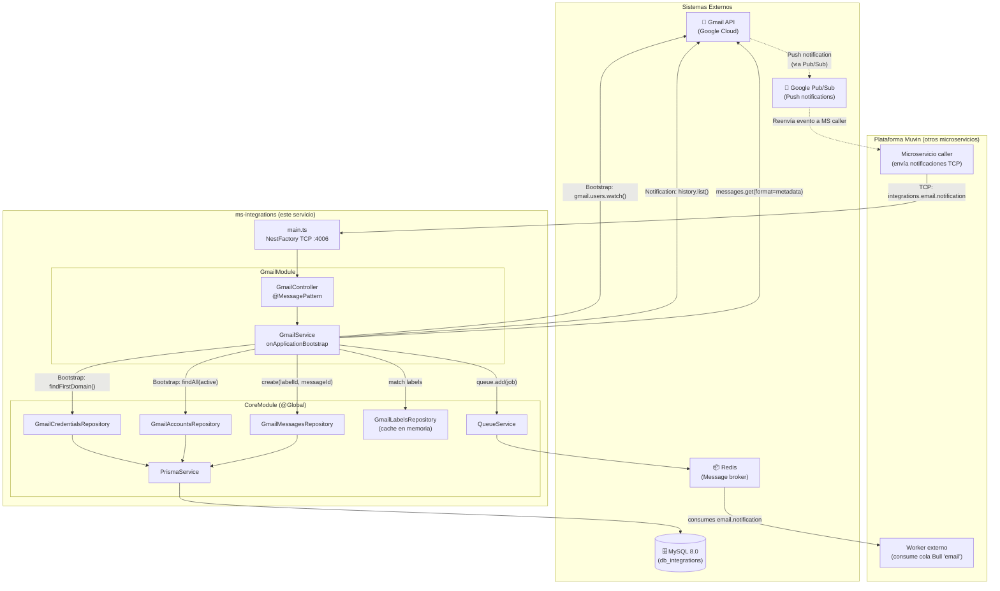
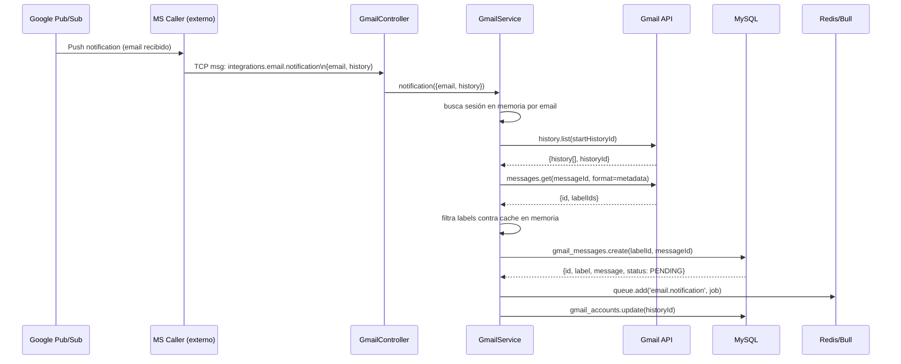

# Arquitectura de Alto Nivel

> **Proyecto:** `muvin-ms-integrations`
> **Revisión:** 2026-04-21

---

## Diagrama de arquitectura general

---

## Descripción de capas

### Capa de Transporte (TCP)
El servicio arranca como microservicio NestJS usando `Transport.TCP`. Escucha en `HOST:PORT` y expone `MessagePattern` para recibir comandos de otros servicios del ecosistema Muvin. No expone endpoints HTTP.

**Archivo:** `src/main.ts`, `src/config/transport.ts`

### Capa de Presentación / Mensajes
`GmailController` recibe el único mensaje activo: `integrations.email.notification`. Delega inmediatamente al servicio sin procesamiento adicional.

**Archivo:** `src/modules/gmail/controller.ts`

### Capa de Lógica de Negocio
`GmailService` contiene toda la lógica:
1. **Bootstrap:** carga credenciales, crea sesiones JWT, suscribe watches de Gmail.
2. **Procesamiento de notificaciones:** consulta historial, identifica mensajes nuevos, filtra por labels configuradas.

**Archivo:** `src/modules/gmail/service.ts`

### Capa de Infraestructura (CoreModule @Global)
Proveedores globales disponibles en toda la aplicación:
- **PrismaService:** acceso a MySQL
- **QueueService:** encolar jobs en Bull/Redis
- **Repositories:** encapsulan todas las operaciones de base de datos

**Archivos:** `src/core/`

### Capa de Datos
- **MySQL 8.0:** almacena credenciales, cuentas, labels y mensajes procesados
- **Redis:** backend de Bull para la cola `email`

### Sistemas externos
- **Gmail API (Google):** API REST para watch, history y messages
- **Google Pub/Sub:** mecanismo de entrega de notificaciones push de Gmail
- **Worker externo:** procesa los jobs de la cola (no vive en este repositorio)

---

## Flujo de vida de una notificación

---

## Ver también

- [[vision-general]]
- [[stack-tecnologico]]
- [[modulo-core]]
- [[modulo-gmail]]
- [[flujo-notificacion-gmail]]
