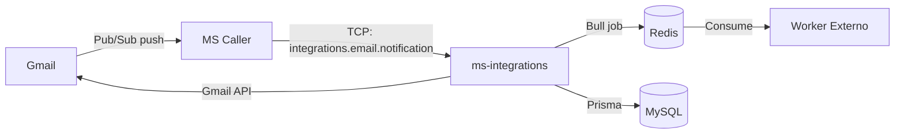

# Visión General

> **Proyecto:** `muvin-ms-integrations` (`ms-integrations`)
> **Revisión:** 2026-04-21

---

## ¿Qué es este microservicio?

`muvin-ms-integrations` es el microservicio de integraciones del ecosistema **Muvin** / **BCR**. Su responsabilidad actual es **monitorear cuentas de Gmail corporativas** y notificar al resto del sistema cuando llegan correos etiquetados con labels específicos.

Actúa como puente entre **Google Workspace** (Gmail) y el ecosistema interno Muvin, traduciendo eventos de Gmail en jobs encolados en Redis para procesamiento posterior.

---

## Alcance actual

| ✅ En scope | ❌ Fuera de scope |
|---|---|
| Recibir notificaciones de Gmail vía TCP | Leer contenido completo de emails |
| Consultar Gmail API (historial, metadata) | Enviar emails |
| Crear registros de mensajes en DB | Procesar el contenido de los mensajes (worker externo) |
| Encolar jobs en Bull/Redis | Gestionar respuestas del worker |
| Gestión de watches de Gmail | UI o HTTP API pública |

---

## Rol en el ecosistema Muvin

---

## Glosario rápido

| Término | Definición |
|---|---|
| **DWD** | Domain-Wide Delegation — permite al service account impersonar cualquier cuenta del dominio |
| **Watch** | Suscripción de Gmail a notificaciones push vía Pub/Sub |
| **HistoryId** | Cursor de Gmail API para obtener cambios incrementales |
| **Label** | Etiqueta de Gmail que clasifica mensajes |
| **Bull** | Sistema de colas basado en Redis |
| **TCP Transport** | Protocolo de comunicación entre microservicios NestJS |

---

## Ver también

- [[arquitectura-alto-nivel]]
- [[stack-tecnologico]]
- [[modulo-gmail]]
- [[flujo-notificacion-gmail]]
