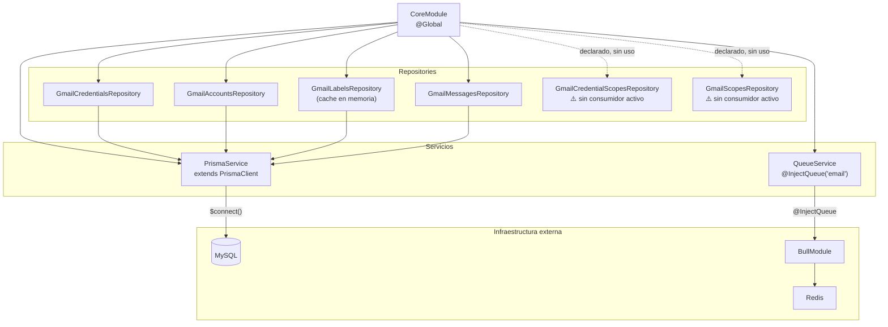

# Módulo: Core

> **Ruta/Namespace:** `src/core/`
> **Responsable histórico:** ⚠️ Pendiente de verificar
> **Criticidad:** 🔴 Alta
> **Estado:** Activo

---

## Propósito

`CoreModule` es el módulo de infraestructura global del microservicio. Está decorado con `@Global()`, lo que significa que todos sus providers están disponibles en cualquier módulo sin necesidad de importarlo explícitamente. Provee acceso a la base de datos (Prisma), al sistema de colas (Bull/Redis) y a todos los repositories de datos de Gmail.

---

## Componentes que expone

| # | Componente | Tipo | Descripción | Detalle |
|---|---|---|---|---|
| 1 | `PrismaService` | Servicio de infraestructura | Cliente ORM para MySQL | [[modulo-core#PrismaService]] |
| 2 | `QueueService` | Servicio de infraestructura | Wrapper sobre Bull para encolar jobs | [[modulo-core#QueueService]] |
| 3 | `GmailCredentialsRepository` | Repository | Acceso a `gmail_credentials` | [[modulo-core#GmailCredentialsRepository]] |
| 4 | `GmailAccountsRepository` | Repository | Acceso a `gmail_accounts` | [[modulo-core#GmailAccountsRepository]] |
| 5 | `GmailLabelsRepository` | Repository | Acceso a `gmail_labels` + cache en memoria | [[modulo-core#GmailLabelsRepository]] |
| 6 | `GmailMessagesRepository` | Repository | Acceso a `gmail_messages` | [[modulo-core#GmailMessagesRepository]] |

---

## Dependencias

- **Depende de:** `BullModule` (Redis), `ENVIRONMENTS` (config), `QUEUES` (config)
- **Es usado por:** `GmailModule` (consume todos los providers vía DI global)
- **Consume servicios backend:** MySQL (vía Prisma), Redis (vía Bull)

---

## Diagrama de componentes internos



---

## Detalle de cada componente

### PrismaService

**Archivo:** `src/core/services/prisma.ts`

Extiende `PrismaClient` e implementa `OnModuleInit` para conectarse automáticamente al iniciar el módulo.

```typescript
// Patrón de uso
export class PrismaService extends PrismaClient implements OnModuleInit {
  public async onModuleInit(): Promise<void> {
    await this.$connect();
  }
}
```

### QueueService

**Archivo:** `src/core/services/queue.ts`

Wrapper delgado sobre Bull. Expone un único método `add<T>(job: T)` que encola en la cola `email` con el job name `email.notification`.

| Parámetro | Valor |
|---|---|
| Nombre de cola | `email` |
| Job type | `email.notification` |
| Backend | Redis |

### GmailCredentialsRepository

**Archivo:** `src/core/repositories/gmail-credentials.ts`

Solo expone `findFirstDomain()`: obtiene la primera credencial de service account disponible. **Solo soporta una credencial activa.**

> [!warning] Single-tenant por diseño actual
> `findFirstDomain()` usa `findFirst()` sin ningún criterio de selección. Si existen múltiples credenciales en la tabla, siempre se tomará la primera. No existe soporte multi-dominio. Ver [[deuda-tecnica]].

### GmailAccountsRepository

**Archivo:** `src/core/repositories/gmail-accounts.ts`

Provee:
- `findAll(where, select)`: busca cuentas activas con campos selectivos
- `updateWatch({id, watch, history, expiration})`: actualiza estado del watch de Gmail
- `updateHistory(id, history)`: actualiza el `historyId` de una cuenta

### GmailLabelsRepository

**Archivo:** `src/core/repositories/gmail-labels.ts`

Implementa `OnApplicationBootstrap`. Al iniciar carga **todos** los labels activos en un array privado inmutable `_list`. Los expone vía getter `list`.

> [!warning] Cache estática sin invalidación
> Los labels se cargan una vez al inicio y nunca se refrescan. Si se agrega o modifica un label en la base de datos, requiere **reiniciar el servicio** para que el cambio surta efecto. Ver [[deuda-tecnica]].

### GmailMessagesRepository

**Archivo:** `src/core/repositories/gmail-messages.ts`

Solo expone `create(labelId, messageId)`: registra un mensaje nuevo con estado `PENDING`.

---

## Riesgos y deuda técnica detectados

- ⚠️ `GmailCredentialScopesRepository` y `GmailScopesRepository` están registrados como providers pero **no son inyectados en ningún servicio**. Código muerto potencial.
- ⚠️ `findFirstDomain()` no tiene criterio de selección: no es apto para entornos multi-tenant.
- 🔴 `GmailLabelsRepository` cachea en memoria al startup sin mecanismo de refresh. Un cambio en `gmail_labels` requiere reinicio del servicio.
- ⚠️ No existe ningún test para ningún componente de este módulo.

---

## Archivos fuente relevantes

- `src/core/module.ts`
- `src/core/services/prisma.ts`
- `src/core/services/queue.ts`
- `src/core/repositories/gmail-credentials.ts`
- `src/core/repositories/gmail-accounts.ts`
- `src/core/repositories/gmail-labels.ts`
- `src/core/repositories/gmail-messages.ts`
- `src/core/repositories/gmail-credential-scopes.ts`
- `src/core/repositories/gmail-scopes.ts`
- `src/core/_index.ts`

---

## Ver también

- [[modulo-gmail]]
- [[entidad-gmail-credentials]]
- [[entidad-gmail-accounts]]
- [[entidad-gmail-labels]]
- [[entidad-gmail-messages]]
- [[deuda-tecnica]]
