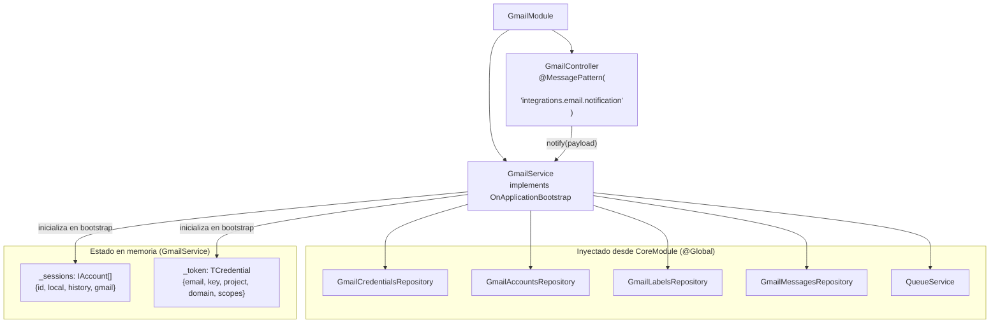

# Módulo: Gmail

> **Ruta/Namespace:** `src/modules/gmail/`
> **Responsable histórico:** ⚠️ Pendiente de verificar
> **Criticidad:** 🔴 Alta
> **Estado:** Activo

---

## Propósito

`GmailModule` es el único módulo de negocio activo del microservicio. Su responsabilidad es integrar el servicio con la Gmail API de Google: suscribir cuentas a notificaciones push, recibir eventos de nuevos emails, identificarlos por labels configurados y encolar el procesamiento en Bull/Redis para que un worker externo los procese.

---

## Funcionalidades que expone

| # | Funcionalidad | Descripción breve | Detalle |
|---|---|---|---|
| 2.1 | Bootstrap de sesiones | Al iniciar: carga credenciales, crea sesiones JWT y suscribe watches | [[gmail-bootstrap]] |
| 2.2 | Procesamiento de notificación | Recibe evento TCP, consulta historial Gmail, filtra por labels, encola job | [[gmail-notification]] |

---

## Dependencias

- **Depende de:** [[modulo-core]] (via @Global: todos sus providers)
- **Es usado por:** `AppModule` (lo importa directamente)
- **Consume servicios backend:** Gmail API (Google), Redis (Bull queue)

---

## Diagrama de componentes internos

---

## Estado en memoria de GmailService

`GmailService` mantiene dos estructuras en memoria que se populan en `onApplicationBootstrap`:

| Campo | Tipo | Descripción | Inicializado desde |
|---|---|---|---|
| `_token` | `TCredential` (frozen) | Credenciales de service account JWT | `gmail_credentials` (DB) |
| `_sessions` | `IAccount[]` | Sesiones activas por cuenta | `gmail_accounts` (DB) + Gmail API |

> [!warning] Estado mutable en sesiones
> El campo `history` dentro de cada `IAccount` **muta en memoria** cuando llega una notificación y se actualiza el `historyId`. Si el proceso se reinicia, se pierde el historyId en memoria y se vuelve a leer desde la base de datos. Esto está correctamente manejado, pero hace el estado difícil de razonar en entornos con múltiples instancias.

---

## Servicios Backend Consumidos

| Verbo | Recurso Gmail API | Propósito | Detalle |
|---|---|---|---|
| POST | `users.watch` | Suscribir cuenta a notificaciones Pub/Sub | [[gmail-api-endpoints#users-watch]] |
| GET | `users.history.list` | Obtener cambios desde un historyId | [[gmail-api-endpoints#users-history-list]] |
| GET | `users.messages.get` | Obtener metadata de un mensaje | [[gmail-api-endpoints#users-messages-get]] |

---

## Entidades de datos implicadas

- Lee: [[entidad-gmail-credentials]], [[entidad-gmail-accounts]], [[entidad-gmail-labels]]
- Escribe: [[entidad-gmail-messages]], [[entidad-gmail-accounts]] (historyId + watch)

---

## Riesgos y deuda técnica detectados

- 🔴 `_syncLabels()` está **comentado** al final de `_init()`. Si los labels cambian en Gmail y no se sincronizan, el filtrado de mensajes puede fallar silenciosamente.
- ⚠️ No hay manejo de error cuando `notification()` recibe un email de una cuenta no registrada en `_sessions` — simplemente retorna `undefined` sin log de alerta adecuado.
- ⚠️ El método `notification()` no retorna nada al caller TCP (`void`). Si el caller espera confirmación, nunca la recibirá.
- ⚠️ El campo `_user` está hardcodeado como `'me'` — correctamente para Gmail API, pero no documentado.
- 🔴 `_setToken()` usa `Object.defineProperty` para hacer el token inmutable — patrón no idiomático en NestJS. Usar `readonly` es preferible.
- ⚠️ Sin tests unitarios ni de integración.
- ⚠️ El código comentado de `_syncLabels()` contiene lógica incompleta que debería eliminarse o completarse.

---

## Archivos fuente relevantes

- `src/modules/gmail/module.ts`
- `src/modules/gmail/controller.ts`
- `src/modules/gmail/service.ts`
- `src/modules/gmail/_index.ts`

---

## Ver también

- [[modulo-core]]
- [[gmail-bootstrap]]
- [[gmail-notification]]
- [[gmail-api-endpoints]]
- [[flujo-notificacion-gmail]]
- [[deuda-tecnica]]
- [[security-inventory]]
