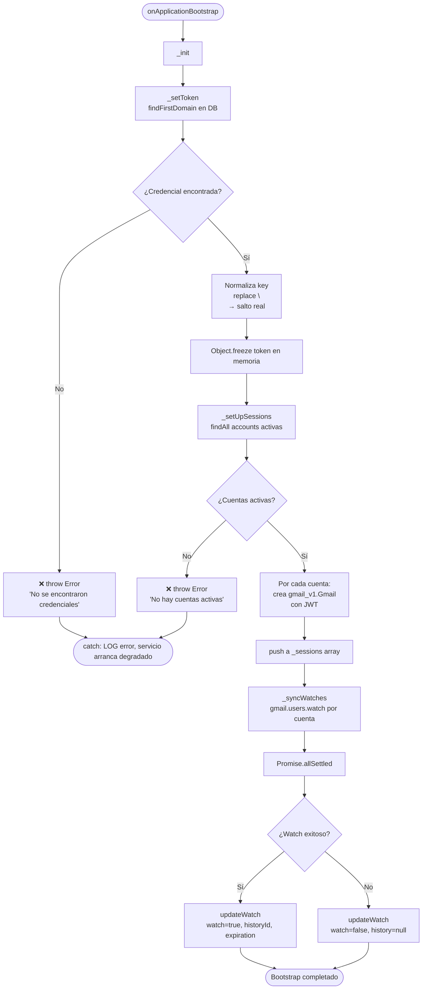

# Funcionalidad: Bootstrap de Sesiones Gmail

> **Módulo:** [[modulo-gmail]]
> **Ruta UI / Endpoint de entrada:** `onApplicationBootstrap()` (automático al iniciar)
> **Tipo:** 🔄 Proceso automático

---

## Descripción funcional

Al iniciar la aplicación, `GmailService` ejecuta automáticamente una secuencia de inicialización que:
1. Carga las credenciales de service account desde la base de datos.
2. Crea sesiones JWT autenticadas para cada cuenta de Gmail activa.
3. Suscribe cada cuenta a notificaciones push de Gmail mediante la API `users.watch`.

Este proceso es crítico: si falla, el servicio no puede procesar notificaciones de email. El error se captura y loguea pero **no detiene el proceso** — el servicio arranca de todas formas en estado degradado.

---

## Precondiciones

- Debe existir al menos una fila en `gmail_credentials` con scopes y dominio configurados.
- Debe existir al menos una fila en `gmail_accounts` con `active = true`.
- El proyecto de Google Cloud configurado en `gmail_credentials.project` debe tener habilitada la Gmail API y Pub/Sub.
- Los scopes de OAuth2 deben incluir al menos `https://www.googleapis.com/auth/gmail.readonly`.

---

## Flujo principal

---

## Flujos alternativos / excepciones

| Escenario | Comportamiento |
|---|---|
| Sin credenciales en DB | Lanza error, capturado en `catch`, servicio arranca sin procesar emails |
| Sin cuentas activas en DB | Lanza error, capturado en `catch`, igual que arriba |
| Watch falla para una cuenta | Solo esa cuenta queda con `watch=false`; las demás continúan |
| La API de Gmail devuelve error en watch | `Promise.allSettled` garantiza que el resto de cuentas se procesen igualmente |

---

## Validaciones de negocio

| Validación | Mensaje | Ubicación en código |
|---|---|---|
| Sin credenciales | `'No se encontraron credenciales.'` | `src/modules/gmail/service.ts:_setToken` |
| Sin cuentas activas | `'No hay cuentas activas configuradas'` | `src/modules/gmail/service.ts:_setUpSessions` |
| Sin sesiones para watch | `'No hay cuentas configuradas para subscribir'` | `src/modules/gmail/service.ts:_syncWatches` |

---

## Servicios backend invocados

| Paso | Recurso | Propósito | Payload resumido | Respuesta resumida |
|---|---|---|---|---|
| 3 | `gmail.users.watch` (POST) | Suscribir cuenta a Pub/Sub | `{userId:'me', requestBody:{topicName: project}}` | `{historyId, expiration}` |

---

## Datos que lee/escribe

- **Lee:** [[entidad-gmail-credentials]] (scopes incluidos), [[entidad-gmail-accounts]] (donde `active=true`)
- **Escribe:** [[entidad-gmail-accounts]] (`watch`, `history`, `expiration` para cada cuenta)

---

## Componentes involucrados

- `GmailService.onApplicationBootstrap()` — `src/modules/gmail/service.ts`
- `GmailService._init()` — `src/modules/gmail/service.ts`
- `GmailService._setToken()` — `src/modules/gmail/service.ts`
- `GmailService._setUpSessions()` — `src/modules/gmail/service.ts`
- `GmailService._syncWatches()` — `src/modules/gmail/service.ts`
- `GmailService._jwt(local)` — `src/modules/gmail/service.ts`

---

## Riesgos específicos

- ⚠️ El error en bootstrap se captura y loguea pero **el servicio arranca igual**. No existe ningún mecanismo de health check que exponga si el bootstrap falló. Un operador podría creer que el servicio está funcionando cuando en realidad no procesa nada.
- ⚠️ `_setToken()` usa `Object.defineProperty` con `writable: false` para inmutabilidad en runtime — patrón no idiomático. Debería ser un campo `private readonly` normal.
- 🔴 `_syncLabels()` está comentado en `_init()`. Los labels no se sincronizan con Gmail en el startup, solo se leen desde la DB. Si los labels de Gmail y los de la DB divergen, el filtrado fallará silenciosamente.
- ⚠️ La key JWT (`gmail_credentials.key`) viene como string con `\n` literal y se normaliza con `.replace(/\\n/g, '\n')`. Esto indica que el valor se almacenó con escaping manual — frágil y dependiente de la convención de carga.
