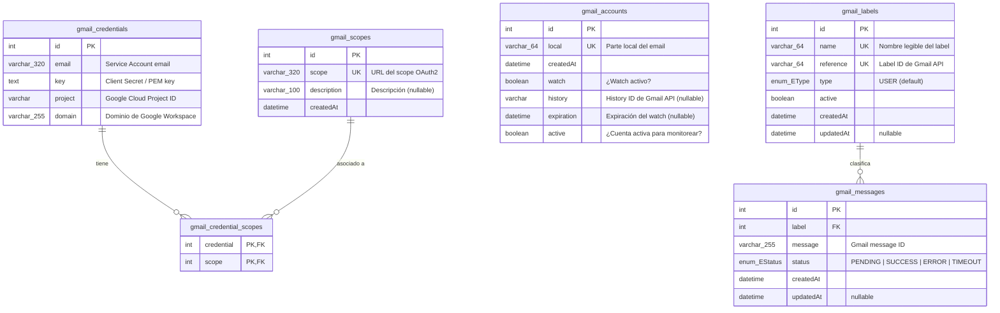

# Diagrama ER Global

> **Proyecto:** `muvin-ms-integrations`
> **Base de datos:** MySQL 8.0 (`db_integrations`)
> **ORM:** Prisma 6.x
> **Revisión:** 2026-04-21

---

## Diagrama entidad-relación

---

## Enums

### `EType`
| Valor | Descripción |
|---|---|
| `USER` | Label de tipo usuario (único valor actual) |

### `EStatus`
| Valor | Descripción |
|---|---|
| `PENDING` | Mensaje recibido, pendiente de procesamiento |
| `SUCCESS` | Mensaje procesado exitosamente |
| `ERROR` | Error en el procesamiento |
| `TIMEOUT` | Procesamiento expiró |

> [!info] Status actualizado por worker externo
> El estado `PENDING` es asignado por este microservicio al crear el registro. Los estados `SUCCESS`, `ERROR` y `TIMEOUT` son actualizados por el **worker externo** que consume la cola Bull. Este microservicio nunca los actualiza.

---

## Relaciones

| Relación | Cardinalidad | Descripción |
|---|---|---|
| `gmail_credentials` → `gmail_credential_scopes` | 1:N | Una credencial puede tener múltiples scopes |
| `gmail_scopes` → `gmail_credential_scopes` | 1:N | Un scope puede estar en múltiples credenciales |
| `gmail_labels` → `gmail_messages` | 1:N | Un label puede tener múltiples mensajes |

---

## Tablas por entidad detallada

- [[entidad-gmail-credentials]]
- [[entidad-gmail-scopes]]
- [[entidad-gmail-credential-scopes]]
- [[entidad-gmail-accounts]]
- [[entidad-gmail-labels]]
- [[entidad-gmail-messages]]

---

## Ver también

- [[modulo-core]]
- [[data-files-index]]
- [[security-inventory]]
