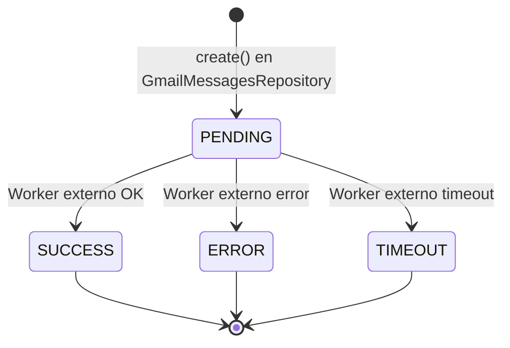

# Entidades de Soporte: gmail_scopes, gmail_credential_scopes, gmail_accounts, gmail_labels, gmail_messages

> **Revisión:** 2026-04-21

---

## Entidad: gmail_scopes {#entidad-gmail-scopes}

**Tabla:** `gmail_scopes`

Catálogo de scopes OAuth2 disponibles para las credenciales de Gmail.

| Campo | Tipo | Nulable | Descripción |
|---|---|---|---|
| `id` | `INT` PK AI | No | Identificador |
| `scope` | `VARCHAR(320)` UNIQUE | No | URL del scope (ej: `https://www.googleapis.com/auth/gmail.readonly`) |
| `description` | `VARCHAR(100)` | Sí | Descripción legible |
| `createdAt` | `DATETIME` | No | Fecha de creación |

**Relaciones:** N:M con `gmail_credentials` vía `gmail_credential_scopes`.

**Módulos:** Leída por `GmailCredentialsRepository` (join con `gmail_credential_scopes`).

---

## Entidad: gmail_credential_scopes {#entidad-gmail-credential-scopes}

**Tabla:** `gmail_credential_scopes`

Tabla intermedia que implementa la relación N:M entre credenciales y scopes.

| Campo | Tipo | Nulable | Descripción |
|---|---|---|---|
| `credential` | `INT` PK,FK | No | FK → `gmail_credentials.id` |
| `scope` | `INT` PK,FK | No | FK → `gmail_scopes.id` |

**On Delete:** Cascade en ambas FK.

---

## Entidad: gmail_accounts {#entidad-gmail-accounts}

**Tabla:** `gmail_accounts`

Registra las cuentas de Gmail del dominio que el servicio monitorea activamente.

| Campo | Tipo | Nulable | Descripción |
|---|---|---|---|
| `id` | `INT` PK AI | No | Identificador |
| `local` | `VARCHAR(64)` UNIQUE | No | Parte local del email (ej: `ventas` de `ventas@empresa.com`) |
| `createdAt` | `DATETIME` | No | Fecha de alta |
| `watch` | `BOOLEAN` | No | `true` si el watch de Gmail está activo |
| `history` | `VARCHAR` | Sí | Último `historyId` procesado de Gmail API |
| `expiration` | `DATETIME` | Sí | Fecha de expiración del watch |
| `active` | `BOOLEAN` | No | Si `false`, la cuenta se ignora en el bootstrap |

> [!warning] Dominio implícito
> Esta tabla solo almacena la parte local del email. El dominio completo se construye dinámicamente combinando `local` + `gmail_credentials.domain`. Si hay múltiples dominios, esto se rompe.

**Módulos:** `GmailAccountsRepository` (findAll, updateWatch, updateHistory).

---

## Entidad: gmail_labels {#entidad-gmail-labels}

**Tabla:** `gmail_labels`

Catálogo de labels de Gmail que el servicio debe observar. Un mensaje solo se procesa si tiene al menos uno de estos labels.

| Campo | Tipo | Nulable | Descripción |
|---|---|---|---|
| `id` | `INT` PK AI | No | Identificador |
| `name` | `VARCHAR(64)` UNIQUE | No | Nombre legible del label |
| `reference` | `VARCHAR(64)` UNIQUE | No | ID del label en Gmail API (ej: `Label_1234567`) |
| `type` | `ENUM(EType)` | No | Siempre `USER` (único valor del enum) |
| `active` | `BOOLEAN` | No | Si `false`, no se usa para filtrado |
| `createdAt` | `DATETIME` | No | Fecha de alta |
| `updatedAt` | `DATETIME` | Sí | Última modificación |

> [!warning] Cache estática
> Los labels se cargan en memoria al bootstrap y **no se recargan**. Cambios en esta tabla requieren reinicio del servicio. Ver [[deuda-tecnica]].

**Módulos:** `GmailLabelsRepository` (cargados al bootstrap, consultados como `_list` en `GmailService`).

---

## Entidad: gmail_messages {#entidad-gmail-messages}

**Tabla:** `gmail_messages`

Registro de mensajes de Gmail que fueron identificados y encolados para procesamiento.

| Campo | Tipo | Nulable | Descripción |
|---|---|---|---|
| `id` | `INT` PK AI | No | Identificador |
| `label` | `INT` FK | No | FK → `gmail_labels.id` |
| `message` | `VARCHAR(255)` | No | ID del mensaje en Gmail API |
| `status` | `ENUM(EStatus)` | No | Estado del procesamiento (default: `PENDING`) |
| `createdAt` | `DATETIME` | No | Fecha de creación |
| `updatedAt` | `DATETIME` | Sí | Última modificación de estado |

**Ciclo de vida del status:**

> [!info] Solo este servicio crea registros
> Los registros son creados con status `PENDING` por `GmailMessagesRepository.create()`. Las transiciones a `SUCCESS`, `ERROR` o `TIMEOUT` son realizadas por el **worker externo** que consume la cola Bull.

**Módulos:** `GmailMessagesRepository.create()`.

---

## Ver también

- [[diagrama-er-global]]
- [[entidad-gmail-credentials]]
- [[modulo-core]]
- [[security-inventory]]
