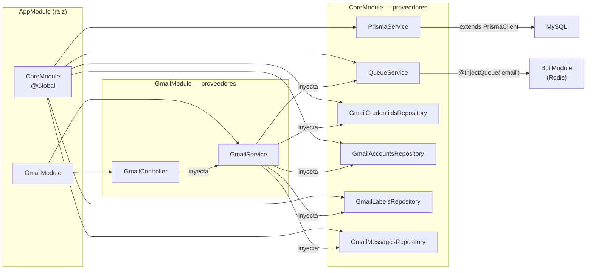

# Dependencias Cross-Module

> **Proyecto:** `muvin-ms-integrations`
> **Revisión:** 2026-04-21

---

## Diagrama de dependencias entre módulos

---

## Tabla de dependencias por componente

| Componente | Depende de | Tipo de dependencia |
|---|---|---|
| `AppModule` | `CoreModule`, `GmailModule` | Importación NestJS |
| `CoreModule` | `BullModule` (Redis), `ENVIRONMENTS`, `QUEUES` | Importación NestJS + config |
| `GmailModule` | `GmailController`, `GmailService` | Declaración local |
| `GmailService` | `GmailCredentialsRepository` | Inyección de dependencia |
| `GmailService` | `GmailAccountsRepository` | Inyección de dependencia |
| `GmailService` | `GmailLabelsRepository` | Inyección de dependencia |
| `GmailService` | `GmailMessagesRepository` | Inyección de dependencia |
| `GmailService` | `QueueService` | Inyección de dependencia |
| `GmailController` | `GmailService` | Inyección de dependencia |
| `GmailCredentialsRepository` | `PrismaService` | Inyección de dependencia |
| `GmailAccountsRepository` | `PrismaService` | Inyección de dependencia |
| `GmailLabelsRepository` | `PrismaService` | Inyección de dependencia |
| `GmailMessagesRepository` | `PrismaService` | Inyección de dependencia |
| `QueueService` | `BullModule` (via `@InjectQueue`) | Inyección de dependencia |
| `PrismaService` | `PrismaClient` (`@db`) | Herencia de clase |

---

## Repositories declarados pero no inyectados en GmailService

| Repository | Declarado en CoreModule | Inyectado en GmailService |
|---|---|---|
| `GmailCredentialsRepository` | ✅ | ✅ |
| `GmailAccountsRepository` | ✅ | ✅ |
| `GmailLabelsRepository` | ✅ | ✅ |
| `GmailMessagesRepository` | ✅ | ✅ |
| `GmailCredentialScopesRepository` | ✅ | ❌ |
| `GmailScopesRepository` | ✅ | ❌ |

> [!warning] Repositories sin consumidor
> `GmailCredentialScopesRepository` y `GmailScopesRepository` están registrados como providers en `CoreModule` pero no son inyectados en ningún servicio activo. Son código muerto potencial. Ver [[deuda-tecnica]].

---

## Dependencias circulares

**No se detectaron dependencias circulares** en la configuración actual. El grafo es un DAG limpio.

---

## Ver también

- [[depends-matrix]]
- [[modulo-core]]
- [[modulo-gmail]]
- [[deuda-tecnica]]
