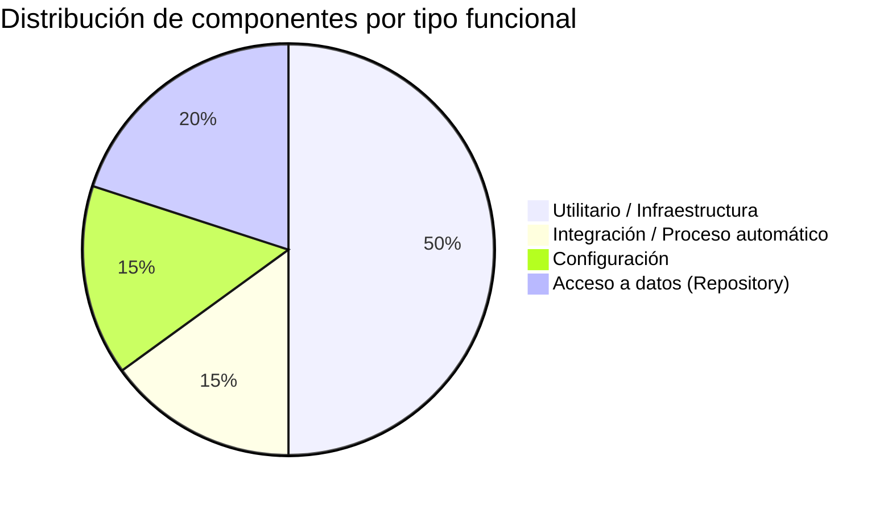

# Clasificación Funcional de Módulos

> **Proyecto:** `muvin-ms-integrations`
> **Revisión:** 2026-04-21

---

## Tabla de clasificación

| Módulo / Componente | Tipo funcional | Subtipo | Descripción |
|---|---|---|---|
| `GmailModule` | Integración 🔌 | Push notification receiver | Recibe notificaciones de Gmail vía TCP y las encola |
| `GmailService` | Integración 🔌 + Proceso automático 🔄 | Bootstrap + event handler | Inicializa sesiones JWT, suscribe watches, procesa historial |
| `GmailController` | Integración 🔌 | Message handler | Expone `MessagePattern` para recibir notificaciones |
| `CoreModule` | Utilitario ⚙️ | Infraestructura global | Provee Prisma, Bull y todos los repositories |
| `PrismaService` | Utilitario ⚙️ | ORM | Conexión a MySQL vía Prisma |
| `QueueService` | Utilitario ⚙️ | Cola | Encola jobs en Bull/Redis |
| `GmailCredentialsRepository` | Utilitario ⚙️ | Acceso a datos | CRUD sobre `gmail_credentials` |
| `GmailAccountsRepository` | Utilitario ⚙️ | Acceso a datos | CRUD sobre `gmail_accounts` |
| `GmailLabelsRepository` | Utilitario ⚙️ | Acceso a datos + Cache | Lee y cachea en memoria `gmail_labels` |
| `GmailMessagesRepository` | Utilitario ⚙️ | Acceso a datos | CRUD sobre `gmail_messages` |
| `contracts/integrations` | Utilitario ⚙️ | Tipado de contratos | Define la interfaz pública del microservicio |
| `contracts/logs` | Utilitario ⚙️ | Tipado de contratos | 💀 Definición sin uso activo |
| `contracts/commercial` | Utilitario ⚙️ | Tipado de contratos | 💀 Definición sin uso activo |
| `common/cmd` | Configuración ⚙️ | Message patterns | Constantes de strings para `@MessagePattern` |
| `common/functions` | Utilitario ⚙️ | Helpers | Logger coloreado, helpers de respuesta |
| `config/environments` | Configuración ⚙️ | Validación env | Joi schema para variables de entorno |
| `config/queues` | Configuración ⚙️ | Nombres de cola | Constantes de nombres de colas Bull |
| `config/transport` | Configuración ⚙️ | Transporte TCP | Constante de tipo de transporte |

---

## Distribución por tipo funcional

---

## Observaciones

> [!info] Sistema orientado a integración
> Este microservicio es **100% orientado a integración externa**. No expone endpoints HTTP, no tiene lógica CRUD de negocio propia, no genera reportes ni tiene wizards. Su única función es recibir eventos de Gmail, clasificarlos y delegar el procesamiento a otro servicio vía cola Bull.

> [!warning] Sin módulos de negocio propios
> Los contratos `commercial` y `logs` están definidos como tipado pero **ningún módulo de negocio** los usa dentro de este repositorio. Probablemente son re-exports para consumidores externos.

---

## Ver también

- [[_indice-modulos]]
- [[modulo-core]]
- [[modulo-gmail]]
- [[reports-and-wizards-inventory]]
