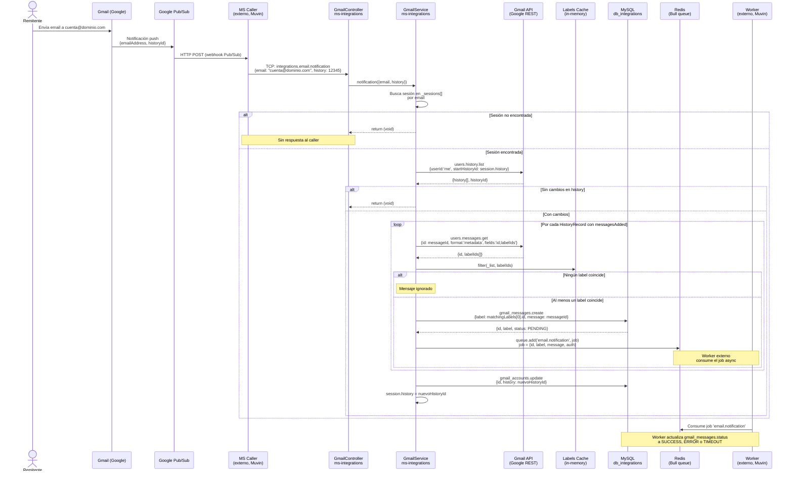

# Flujo: Notificación Gmail End-to-End

> **Proyecto:** `muvin-ms-integrations`
> **Revisión:** 2026-04-21
> **Alcance:** Desde que llega un email a Gmail hasta que el job queda en Redis

---

## Descripción

Este flujo cubre el camino completo de una notificación de email: desde que Google genera el evento de Pub/Sub hasta que el job queda disponible en Redis para que un worker externo lo procese. Atraviesa múltiples sistemas: Google Cloud, el ecosistema Muvin y este microservicio.

---

## Diagrama de secuencia completo

---

## Puntos de integración externos

| Sistema | Protocolo | Dirección | Descripción |
|---|---|---|---|
| Google Pub/Sub | HTTP Push | Entrada (indirecta vía MS Caller) | Notifica que hay emails nuevos |
| Gmail API | REST/JWT | Salida | Consulta historial y metadata |
| Redis / Bull | TCP | Salida | Encola jobs para worker |
| MySQL | TCP | Bidireccional | Lee config, escribe mensajes |
| MS Caller (externo) | TCP NestJS | Entrada | Reenvía evento Pub/Sub |
| Worker (externo) | Redis/Bull | Consume | Procesa jobs encolados |

---

## Tiempos y latencias esperadas

| Etapa | Latencia esperada | Notas |
|---|---|---|
| Gmail → Pub/Sub | Segundos | Controlado por Google |
| Pub/Sub → MS Caller | Segundos | Depende de infraestructura Muvin |
| MS Caller → ms-integrations (TCP) | <100ms | Red interna |
| history.list (Gmail API) | 200-500ms | Depende de Google |
| messages.get (Gmail API) | 100-300ms por mensaje | Por cada mensaje nuevo |
| DB write + queue.add | <50ms | Local |

---

## Puntos de falla

| Punto | Impacto | Manejo actual |
|---|---|---|
| Gmail API no disponible | 🔴 Mensajes no procesados | ⚠️ Sin retry ni circuit breaker |
| Redis no disponible | 🔴 Jobs no encolados | ⚠️ Bull puede reintentar, pero sin configuración documentada |
| MySQL no disponible | 🔴 Sin persistencia ni procesamiento | ⚠️ Sin manejo explícito |
| Watch expirado | 🔴 Sin notificaciones | ⚠️ Sin renovación automática |
| Bootstrap fallido | 🔴 Servicio inoperante silenciosamente | ⚠️ Log pero sin health check expuesto |

---

## Ver también

- [[gmail-bootstrap]]
- [[gmail-notification]]
- [[gmail-api-endpoints]]
- [[hotspots]]
- [[deuda-tecnica]]
