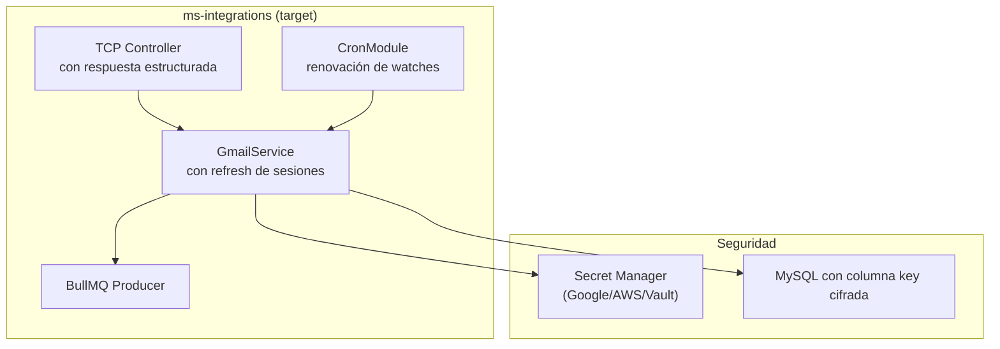

# Recomendaciones de Modernización

> **Proyecto:** `muvin-ms-integrations`
> **Revisión:** 2026-04-21

---

## Plan de modernización por sprints

### 🔴 Sprint 1 — Críticos de seguridad (1-2 días)

| Acción | Archivo | Impacto |
|---|---|---|
| Eliminar `auth.key` del payload Bull | `service.ts` | SEC-01 |
| Eliminar `console.error` con TODO | `environments.ts` | SEC-04 |
| Crear `.env.example` | raíz | DT-03 |
| Corregir alias `@repositories` en tsconfig.paths | `tsconfig.paths.json` | DT-09 |

---

### 🟡 Sprint 2 — Estabilidad operacional (3-5 días)

| Acción | Archivo | Impacto |
|---|---|---|
| Añadir renovación automática de watches (cron) | `service.ts` nuevo cron | DT-07 |
| Cambiar `notification()` a respuesta estructurada | `controller.ts`, `service.ts` | DT-12 |
| Descomentar o eliminar definitivamente `_syncLabels()` | `service.ts` | DT-08 |
| Eliminar repositories no usados del barrel/CoreModule | `core/` | DT-10 |

---

### 🟢 Sprint 3 — Calidad y tests (1 semana)

| Acción | Detalle |
|---|---|
| Suite de tests unitarios con Jest | `GmailService`, repositorios |
| Tests de integración con DB en memoria | SQLite o testcontainers |
| Configurar coverage > 80% en CI | Añadir `--coverage` al pipeline |

---

### 🔵 Sprint 4 — Modernización de dependencias (1-2 semanas)

| Acción | Detalle |
|---|---|
| Migrar Bull v4 → BullMQ | `@nestjs/bullmq` + `bullmq` |
| Evaluar cifrado de credenciales en DB | AES-256-GCM o Google Secret Manager |
| Implementar soporte multi-credencial | `GmailCredentialsRepository.findByDomain()` |

---

## Arquitectura target sugerida

---

## Ver también

- [[security-inventory]]
- [[deuda-tecnica]]
- [[hotspots]]
