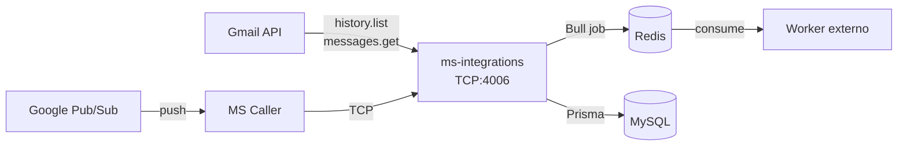

# README — Documentación técnica de ms-integrations

> **Proyecto:** `muvin-ms-integrations`
> **Versión:** 1.0.0
> **Revisión:** 2026-04-21

---

## ¿Qué hace este microservicio?

Monitorea cuentas de Gmail corporativas y notifica al ecosistema Muvin cuando llegan correos con labels específicos. Actúa como puente entre Google Workspace y la cola de procesamiento interna.



---

## Índice de secciones

### 00 — Overview
| Documento | Descripción |
|---|---|
| [[vision-general]] | Qué hace, alcance, glosario |
| [[arquitectura-alto-nivel]] | Diagrama de contexto completo |
| [[stack-tecnologico]] | Dependencias y versiones |

### 01 — Módulos
| Documento | Descripción |
|---|---|
| [[_indice-modulos]] | Tabla de todos los módulos |
| [[modulo-core]] | CoreModule: repositorios, servicios, infraestructura |
| [[modulo-gmail]] | GmailModule: controlador, servicio, bootstrap |

### 02 — Funcionalidades
| Documento | Descripción |
|---|---|
| [[_indice-funcionalidades]] | Tabla de todas las funcionalidades |
| [[gmail-bootstrap]] | Inicialización: token, sesiones, watches |
| [[gmail-notification]] | Procesamiento de notificaciones |

### 03 — Servicios Backend
| Documento | Descripción |
|---|---|
| [[_indice-servicios]] | Tabla de servicios |
| [[gmail-api-endpoints]] | Endpoints de Gmail API consumidos |

### 04 — Modelo de Datos
| Documento | Descripción |
|---|---|
| [[_indice-entidades]] | Tabla de entidades |
| [[diagrama-er-global]] | Diagrama ER completo (Mermaid) |
| [[entidad-gmail-credentials]] | Credenciales de service account |
| [[entidades-soporte]] | gmail_scopes, gmail_accounts, gmail_labels, gmail_messages |

### 05 — Inventarios
| Documento | Descripción |
|---|---|
| [[tree-estructura-archivos]] | Árbol de archivos comentado |
| [[functional-classification]] | Clasificación funcional de archivos |
| [[data-files-index]] | Índice de archivos de datos |
| [[cross-module-dependencies]] | Dependencias entre módulos |
| [[depends-matrix]] | Matriz de dependencias |
| [[core-vs-custom-dependencies]] | Core (NestJS) vs custom (propio) |

### 06 — Flujos Transversales
| Documento | Descripción |
|---|---|
| [[_indice-flujos]] | Tabla de flujos |
| [[flujo-notificacion-gmail]] | Flujo completo end-to-end (sequenceDiagram) |

### 07 — Operación y Despliegue
| Documento | Descripción |
|---|---|
| [[operacion]] | Requisitos, build, despliegue, config de Google |

### 08 — Riesgos y Deuda Técnica
| Documento | Descripción |
|---|---|
| [[security-inventory]] | Inventario de seguridad (3 críticos, 4 medios) |
| [[hotspots]] | Zonas de alto riesgo en el código |
| [[deuda-tecnica]] | 12 ítems de deuda catalogados |
| [[recomendaciones-modernizacion]] | Plan por sprints |

---

## Estado de riesgos

| Nivel | Cantidad | Ver |
|---|---|---|
| 🔴 CRÍTICO | 3 seguridad + 2 deuda | [[security-inventory]] |
| 🟡 MEDIO | 4 seguridad + 6 deuda | [[deuda-tecnica]] |
| 🟢 BAJO | 2 | [[security-inventory]] |

**Riesgo más urgente:** Clave privada PEM incluida en payload de Bull/Redis → [[security-inventory#SEC-01]]

---

## Quick start

```bash
npm install
cp .env.example .env  # Crear si no existe
docker-compose -f docker/docker-compose.yml up -d
npx prisma migrate deploy
npm run start:dev
```

---

*Documentación generada con análisis estático del código fuente. Última actualización: 2026-04-21.*
