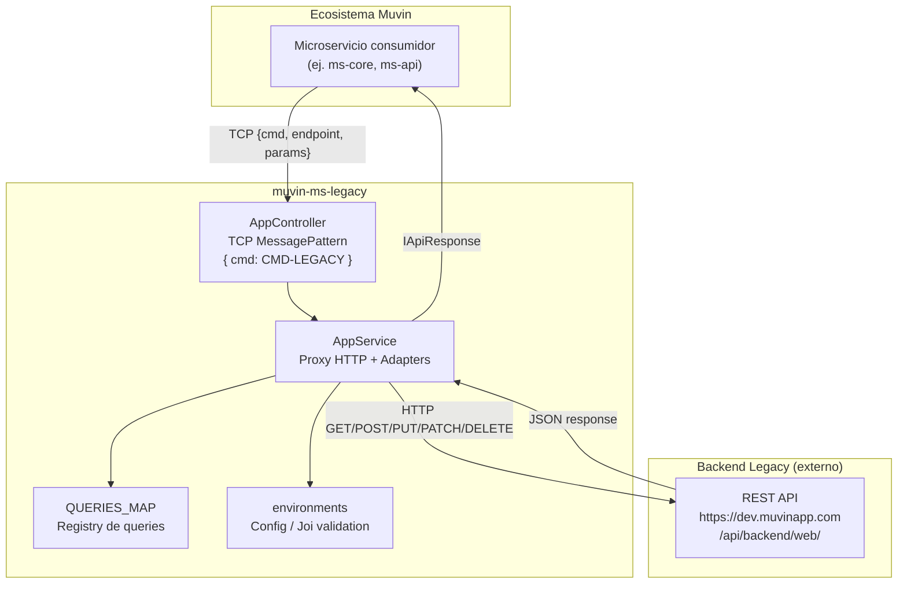
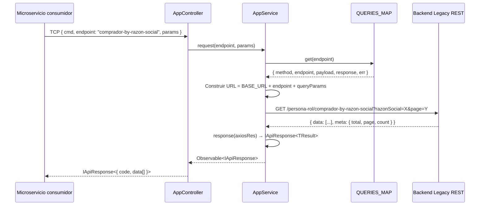

# Arquitectura de alto nivel

> **Proyecto:** `muvin-ms-legacy`
> **Última revisión:** 2026-04-21

## Descripción general

`muvin-ms-legacy` es un **microservicio puente (proxy adapter)**. Se ubica entre el ecosistema de microservicios Muvin y un backend REST legacy. Su rol es doble:

1. **Entrada:** exponer un contrato TCP tipado para que otros microservicios lo consuman sin conocer el backend legacy.
2. **Salida:** traducir esas solicitudes a llamadas HTTP REST contra el sistema legacy, y normalizar las respuestas.

## Diagrama de arquitectura de alto nivel

## Capas de la arquitectura

### Capa 1 — Transporte (entrada)

- **Protocolo:** TCP (NestJS Microservices)
- **Implementación:** `AppController` con `@MessagePattern({ cmd })`
- **Datos de entrada:** `{ endpoint: K; params?: IRequests[K]['params'] }`
- **Puerto:** configurable vía `LEGACY_MICROSERVICE_PORT` (default `4001`)

### Capa 2 — Enrutamiento de queries

- **Implementación:** `QUERIES_MAP` en `src/api/map.ts`
- **Patrón:** Registry (Map de clave → definición de query)
- **Responsabilidad:** dada una clave de endpoint, devuelve el objeto con método HTTP, ruta, y adapters de transformación

### Capa 3 — Proxy HTTP

- **Implementación:** `AppService` en `src/service.ts`
- **Biblioteca:** `@nestjs/axios` (wrapper de Axios)
- **Responsabilidades:**
  - Construir la URL: `BASE_URL + endpoint + queryParams`
  - Aplicar el adapter de payload (body)
  - Ejecutar la llamada HTTP según el método
  - Aplicar el adapter de respuesta exitosa
  - Aplicar el adapter de error
  - Retornar un `Observable<IApiResponse<T>>`

### Capa 4 — Adapters (transformación)

- **Patrón:** Adapter / Transformer
- **Implementación:** funciones `payload`, `response`, `err` dentro de cada archivo en `src/api/queries/`
- **Propósito:** desacoplar el modelo del backend legacy del modelo expuesto al ecosistema Muvin

### Capa 5 — Backend externo (legacy)

- REST API externa a este microservicio
- URL base en `LEGACY_MICROSERVICE_BASE_URL`
- Retorna respuestas en formato propio que los adapters normalizan

## Diagrama de secuencia de una request completa

## Nota sobre el nombre "legacy"

> [!info] Aclaración terminológica
> El prefijo "legacy" en `muvin-ms-legacy` hace referencia al **backend externo** al que se conecta (el sistema REST de Muvin con varios años de antigüedad), **no** a este microservicio en sí. Este microservicio está construido con tecnologías modernas (NestJS 11, TypeScript 5.7, Node 20).

## Riesgos arquitecturales

| Riesgo | Descripción | Severidad |
|--------|-------------|-----------|
| Sin autenticación explícita hacia el legacy | No se observa token/API key en las calls HTTP del código | 🔴 |
| Único punto de fallo | Todo el tráfico al backend legacy pasa por un único método (`AppService.request`) | 🟡 |
| Sin circuit breaker | No hay mecanismo de corte de circuito si el backend legacy falla | 🟡 |
| Sin retry logic | Los errores HTTP no tienen reintentos configurados | 🟡 |
| Sin caché | Cada request al backend legacy es una nueva llamada HTTP | 🟡 |
