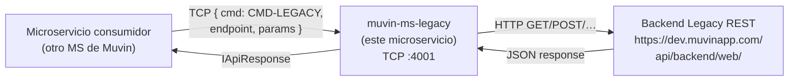

# Visión general

> **Proyecto:** `muvin-ms-legacy`
> **Última revisión:** 2026-04-21

## ¿Qué es este microservicio?

`muvin-ms-legacy` es un **proxy adaptador TCP→HTTP** dentro del ecosistema Muvin. Su función es:

1. Recibir mensajes TCP de otros microservicios de Muvin.
2. Traducir esos mensajes a peticiones HTTP REST hacia un **backend legacy externo**.
3. Normalizar la respuesta del backend legacy al formato estándar del ecosistema.
4. Devolver la respuesta normalizada al microservicio consumidor.

El término "legacy" hace referencia al **backend externo**, no al microservicio en sí. Este microservicio está construido con tecnología actual (NestJS 11, TypeScript 5.7).

## Posición en el ecosistema Muvin

## Responsabilidades

| Responsabilidad | ¿Dónde? |
|-----------------|---------|
| Recibir mensajes TCP | `src/controller.ts` |
| Resolver la query correcta | `src/api/map.ts` (QUERIES_MAP) |
| Construir la URL y ejecutar HTTP | `src/service.ts` |
| Normalizar datos | `src/api/queries/*.ts` |
| Definir contratos de respuesta | `src/contracts/` |
| Configurar el microservicio | `src/config/environments.ts` |

## ¿Qué NO hace este microservicio?

- No tiene base de datos propia.
- No tiene autenticación de usuarios (solo proxy de mensajes).
- No expone HTTP directamente (solo TCP).
- No implementa lógica de negocio; solo transforma y delega.

## Estado actual

| Aspecto | Estado |
|---------|--------|
| Endpoints implementados | 1 de 2 declarados |
| Cobertura de tests | 0% (sin tests) |
| Hallazgos de seguridad críticos | 2 (`console.log`, `catch` sin contexto) |
| Deuda técnica priorizada | 9 items |

> [!warning]
> Este microservicio tiene 2 hallazgos de seguridad críticos pendientes. Ver [[security-inventory]] y [[deuda-tecnica]].

## Números del proyecto

- **Archivos fuente:** 25 (`src/`)
- **Líneas de código estimadas:** ~500 LOC
- **Dependencias de producción:** 8 paquetes
- **Variables de entorno requeridas:** 5
- **Queries implementadas:** 1 (`comprador-by-razon-social`)
- **Queries declaradas sin implementar:** 1 (`comprador-by-cuit`)
- **Archivos de código muerto:** 4 (`src/common/`)
