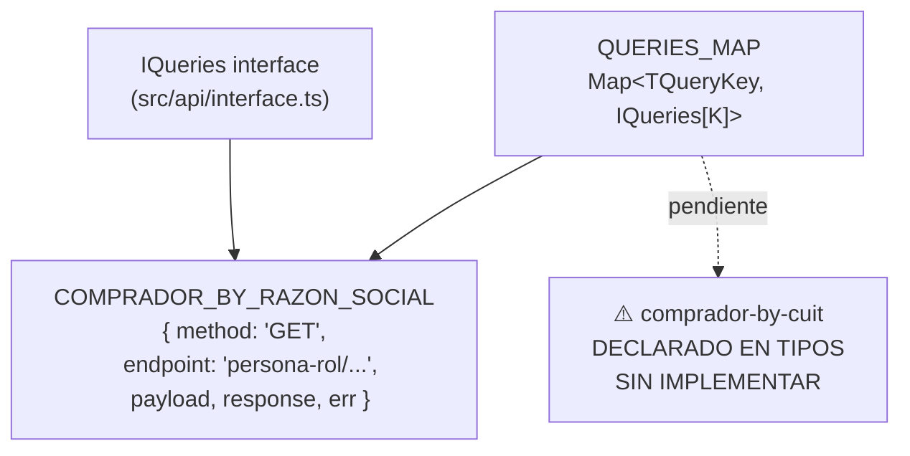

# Módulo: API / Query Registry

> **Ruta/Namespace:** `src/api/`
> **Responsable histórico:** ⚠️ Pendiente de verificar
> **Criticidad:** 🟡 Media
> **Estado:** Activo (incompleto — hay endpoints declarados sin implementar)

## Propósito

Implementa el patrón **Registry** para el sistema de queries. Define el "mapa" de endpoints disponibles: cada entrada asocia una clave string (`TQueryKey`) con un objeto que describe cómo llamar al backend legacy (método HTTP, ruta, adapters de transformación).

## Funcionalidades que expone

| # | Funcionalidad | Descripción breve | Detalle |
|---|---------------|-------------------|---------|
| 3.1 | `QUERIES_MAP` | Map<TQueryKey, IQueries[K]>: registro de queries activas | — |
| 3.2 | `IQueries` (interface) | Contrato tipado del mapa de queries | — |
| 3.3 | `COMPRADOR_BY_RAZON_SOCIAL` | Definición completa de la query de búsqueda por razón social | [[api-comprador-by-razon-social]] |

## Dependencias

- **Depende de:** [[modulo-types]] (TQueryKey), [[modulo-common]] (IDENTITY), [[modulo-contracts]] (IRequests)
- **Es usado por:** [[modulo-service]] (QUERIES_MAP)

## Diagrama de componentes internos



## Estructura de una query (patrón)

Cada archivo en `src/api/queries/` sigue este patrón:

```typescript
// 1. Tipos locales (forma del servidor y del cliente)
interface IRes { ... }   // Respuesta cruda del backend legacy
interface IErr { ... }   // Error crudo del backend legacy

// 2. Adapters
function payload(payload: TClient): TServer { ... }    // Transforma el body antes de enviarlo
function response(res: AxiosResponse<TRes>): TResult { ... }  // Normaliza la respuesta
function err(err: AxiosError<TErr>): TResult { ... }   // Normaliza el error

// 3. Constante exportada
export const NOMBRE_QUERY: TNombreQuery = {
  method: 'GET',
  endpoint: 'ruta/en/el/backend',
  payload,
  response,
  err,
};
```

## Endpoints registrados vs. declarados

| Endpoint | Clave en `IQueries` | En `QUERIES_MAP` | En `TEndpoint` | Estado |
|----------|--------------------|--------------------|----------------|--------|
| `persona-rol/comprador-by-razon-social` | ✔ | ✔ | ✔ | 🟢 Implementado |
| `persona-rol/comprador-by-cuit` | ✗ | ✗ | ✔ | ⚠️ Solo en tipos, sin implementar |

## Riesgos y deuda técnica detectados

- ⚠️ **`comprador-by-cuit` incompleto:** el tipo `TEndpoint` declara la ruta `persona-rol/comprador-by-cuit`, pero no existe query ni entrada en `IQueries` ni en `QUERIES_MAP`. Si alguien invoca ese endpoint por TCP, el servicio lanzará `"No endpoint found for query"`.
- 🟡 **Sin validación de query params en la capa de API:** los `queryParams` son pasados directamente como `Record<string, string | number | boolean>` sin validación de esquema en la capa de query. La validación se delega al `ValidationPipe` del controlador.
- ⚠️ **`IDENTITY` como payload adapter:** la query `comprador-by-razon-social` usa `IDENTITY` como función de transformación de payload, lo que significa que el body enviado al backend legacy es exactamente igual al recibido por el microservicio. Esto es intencional para un GET sin body, pero debería documentarse explícitamente.

## Archivos fuente relevantes

- `src/api/map.ts`
- `src/api/interface.ts`
- `src/api/queries/_index.ts`
- `src/api/queries/comprador-by-razon-social.ts`
