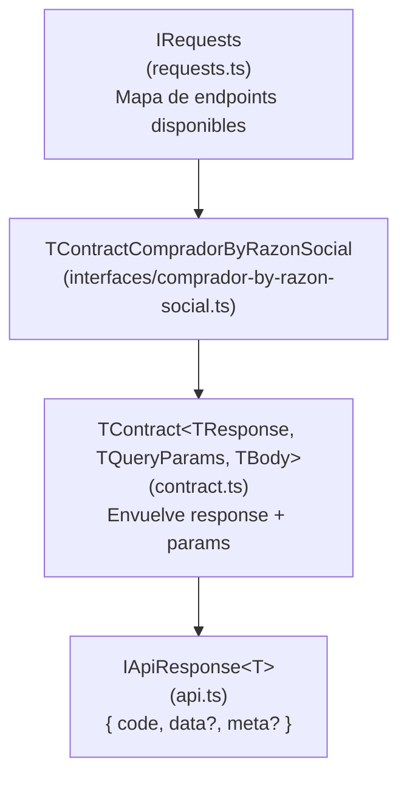

# Módulo: Contratos del Microservicio

> **Ruta/Namespace:** `src/contracts/ms-legacy/`
> **Criticidad:** 🟡 Media
> **Estado:** Activo

## Propósito

Define la **API pública** del microservicio `muvin-ms-legacy`. Estos contratos son los tipos que deben conocer los microservicios que lo consumen. Establecen qué endpoints se pueden llamar, qué parámetros reciben y qué tipo de respuesta devuelven.

> [!info] Separación de responsabilidades
> Los contratos deberían ser compartidos vía un package NPM privado o un monorepo con workspaces para que los consumidores los importen directamente. En el estado actual, los consumidores deben copiar o referenciar estos tipos manualmente.

## Estructura de contratos



## Tipos exportados

| Tipo | Archivo | Descripción |
|------|---------|-------------|
| `IApiResponse<T>` | `api.ts` | Respuesta estándar del microservicio: `{ code, data?, meta? }` |
| `IMeta` | `api.ts` | Paginación: `{ pages, current, items }` |
| `TContract<TResponse, TQueryParams, TBody>` | `contract.ts` | Tipo base para definir contratos de endpoint |
| `IRequests` | `requests.ts` | Interface que lista todos los endpoints disponibles |
| `TContractCompradorByRazonSocial` | `interfaces/comprador-by-razon-social.ts` | Contrato específico del endpoint de búsqueda |
| `TResultCompradorByRazonSocial` | `interfaces/comprador-by-razon-social.ts` | Tipo del array de resultados |

## Forma de `IApiResponse<T>`

```typescript
interface IApiResponse<T> {
  readonly code: number;      // HTTP status code del backend legacy
  readonly data?: T;          // Payload de la respuesta transformado
  readonly meta?: IMeta;      // Paginación (opcional)
}
```

> [!warning] Interfaz de error comentada
> Existe código comentado en `api.ts` que define `IError` con `code` y `message`. El campo `error` en `IApiResponse` también está comentado. Actualmente los errores solo se propagan como `code` numérico y `data: []`. Ver [[deuda-tecnica]].

## Riesgos y deuda técnica detectados

- ⚠️ **No hay campo `error` en `IApiResponse`:** cuando el backend legacy falla, el adaptador de error devuelve `{ code: 500, data: [] }`. No hay distinción entre "sin resultados" y "error del servidor".
- ⚠️ **Contratos comentados en `IRequests`:** hay ejemplos comentados para endpoints adicionales (`otro-endpoint-sin-parametros`, `endpoint-con-body`). Indican intención de expansión pero generan ruido.
- 🟡 **Sin versionado del contrato:** no hay mecanismo para versionar la API del microservicio. Cambios breaking en los contratos requieren coordinación manual con todos los consumidores.

## Archivos fuente relevantes

- `src/contracts/ms-legacy/_index.ts`
- `src/contracts/ms-legacy/api.ts`
- `src/contracts/ms-legacy/contract.ts`
- `src/contracts/ms-legacy/requests.ts`
- `src/contracts/ms-legacy/interfaces/comprador-by-razon-social.ts`
