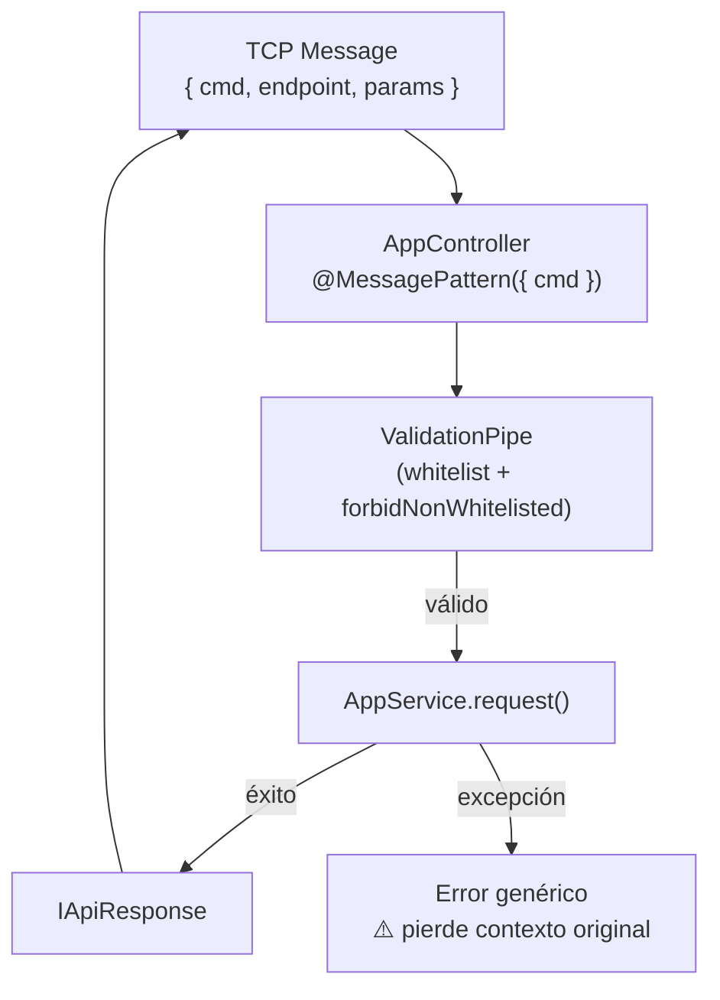

# Módulo: Controlador TCP (AppController)

> **Ruta/Namespace:** `src/controller.ts`
> **Responsable histórico:** ⚠️ Pendiente de verificar
> **Criticidad:** 🔴 Alta
> **Estado:** Activo

## Propósito

Punto de entrada del microservicio. Recibe mensajes TCP mediante el patrón de NestJS `@MessagePattern` y delega el procesamiento al `AppService`. Es la única interfaz pública del microservicio hacia el ecosistema Muvin.

## Funcionalidades que expone

| # | Funcionalidad | Descripción breve | Detalle |
|---|---------------|-------------------|---------|
| 1.1 | `request<K>` | Recibe un endpoint + params, retorna `IApiResponse<T>` | [[api-comprador-by-razon-social]] |

## Dependencias

- **Depende de:** [[modulo-service]], [[modulo-config]], [[modulo-common]], [[modulo-contracts]], [[modulo-types]]
- **Es usado por:** Microservicios externos del ecosistema Muvin (vía TCP)
- **Consume servicios backend:** No directamente. Delega a `AppService`.

## Diagrama de componentes internos

## Servicios Backend Consumidos

> Este módulo no consume servicios backend directamente. Delega completamente a [[modulo-service]].

## Entidades de datos implicadas

> No gestiona entidades de datos propias. Los tipos de entrada/salida están definidos en [[modulo-contracts]].

## Riesgos y deuda técnica detectados

- 🔴 **`console.log(payload)` en línea 33:** expone el payload recibido (que puede contener datos sensibles como razones sociales, CUITs) en los logs del contenedor sin control de nivel ni sanitización.
- 🔴 **`console.log(res)` en línea 37:** expone la respuesta completa del backend legacy en los logs.
- ⚠️ **`catch` rethrows `new Error()`:** en el bloque catch del método `request`, se captura el error original y se lanza un `new Error()` genérico. Esto destruye el stack trace y el mensaje de error original, dificultando el debugging.
- ⚠️ **`throw new Error()` sin mensaje:** el error relanzado no tiene mensaje descriptivo, lo que hace imposible distinguir la causa en producción.

## Archivos fuente relevantes

- `src/controller.ts`
- `src/contracts/ms-legacy/requests.ts` (define `IRequests`)
- `src/contracts/ms-legacy/api.ts` (define `IApiResponse`)
