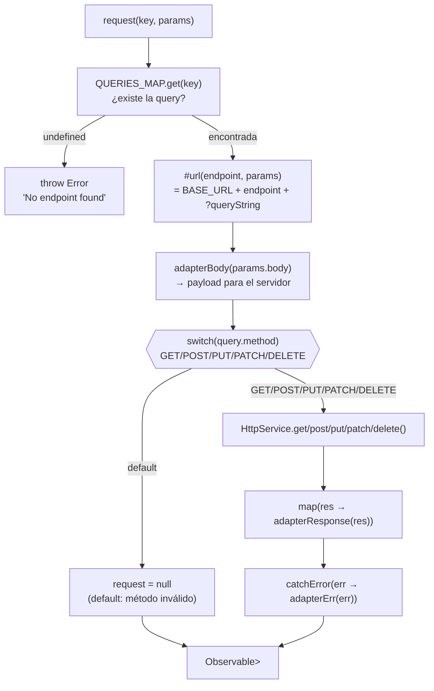

# Módulo: Servicio Proxy HTTP (AppService)

> **Ruta/Namespace:** `src/service.ts`
> **Responsable histórico:** ⚠️ Pendiente de verificar
> **Criticidad:** 🔴 Alta
> **Estado:** Activo

## Propósito

Núcleo del microservicio. Dado un nombre de query (`TQueryKey`) y sus parámetros opcionales, resuelve la definición de la query desde el `QUERIES_MAP`, construye la URL final, ejecuta la llamada HTTP al backend legacy usando `@nestjs/axios`, y retorna un `Observable<IApiResponse<T>>` con la respuesta transformada por el adapter correspondiente.

## Funcionalidades que expone

| # | Funcionalidad | Descripción breve | Detalle |
|---|---------------|-------------------|---------|
| 2.1 | `request<K>(key, params?)` | Método público principal: proxy tipado al backend legacy | [[api-comprador-by-razon-social]] |
| 2.2 | `#url(endpoint, params?)` | Método privado: construye la URL final con query string | — (interno) |

## Dependencias

- **Depende de:** `QUERIES_MAP` ([[modulo-api]]), `@nestjs/axios` (HttpService), [[modulo-config]], [[modulo-common]], [[modulo-types]], [[modulo-contracts]]
- **Es usado por:** [[modulo-controller]]
- **Consume servicios backend:** sí, directamente — ver [[persona-rol-endpoints]]

## Diagrama de componentes internos

## Servicios Backend Consumidos

| Verbo | Ruta | Propósito | Detalle |
|-------|------|-----------|---------|
| GET | `persona-rol/comprador-by-razon-social` | Buscar compradores por razón social | [[persona-rol-endpoints#GET-comprador-by-razon-social]] |
| GET | `persona-rol/comprador-by-cuit` | Buscar compradores por CUIT | ⚠️ Declarado en `TEndpoint`, sin query implementada |

## Entidades de datos implicadas

- **Lee:** Datos de compradores del backend legacy (ver [[entidad-comprador]])
- **Escribe:** No. Sólo operaciones de lectura actualmente.

## Riesgos y deuda técnica detectados

- ⚠️ **Castings `as unknown as T`:** el servicio usa triple cast para asignar los adapters a tipos concretos (`adapterBody`, `adapterResponse`, `adapterErr`). Esto evade el sistema de tipos e introduce un posible error silencioso si un adapter no es compatible.
- ⚠️ **`request = null` en `default` del switch:** si se registra un query con un método HTTP inválido, el `switch` llega al `default` y `request` queda en `null`. El check posterior lanza un error, pero podría ser más explícito.
- 🟡 **Sin timeout por query:** el timeout HTTP es global (5000 ms, configurado en el módulo), no se puede configurar por endpoint.
- 🟡 **Sin retry policy:** no hay lógica de reintento ante fallos transitorios del backend legacy.
- 🟡 **Sin circuit breaker:** si el backend legacy está caído, todos los mensajes TCP fallarán hasta que vuelva.

## Archivos fuente relevantes

- `src/service.ts`
- `src/api/map.ts`
- `src/types/request.ts` (define `TRequest`)
- `src/module.ts` (configura `HttpModule` con timeout)
