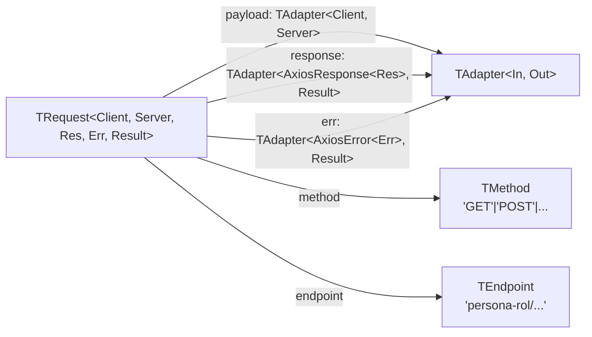

# Módulo: Sistema de Tipos Internos

> **Ruta/Namespace:** `src/types/`
> **Criticidad:** 🟢 Baja
> **Estado:** Activo

## Propósito

Define el sistema de tipos genérico que hace posible que `AppService` sea un proxy HTTP **type-safe** para cualquier combinación de endpoint, payload y respuesta. Todos los tipos son TypeScript puro (sin runtime); se eliminan en la compilación.

## Tipos exportados y su rol

| Tipo | Archivo | Descripción |
|------|---------|-------------|
| `TAdapter<Res, Result>` | `adapters.ts` | Función `(res: Res) => Result`. Base del sistema de adapters. |
| `TClient<K>` | `client.ts` | Tipo del parámetro de entrada del adapter `payload` de la query `K` |
| `TServer<K>` | `server.ts` | Tipo de retorno del adapter `payload` (lo que se envía al servidor) |
| `TRes<K>` | `res.ts` | Tipo de parámetro del adapter `response` (respuesta cruda del backend) |
| `TErr<K>` | `err.ts` | Tipo de parámetro del adapter `err` (error crudo del backend) |
| `TResult<K>` | `result.ts` | Tipo de retorno del adapter `response` (resultado normalizado) |
| `TEndpoint` | `endpoints.ts` | Unión de rutas válidas al backend legacy |
| `TMethod` | `methods.ts` | `'GET' \| 'POST' \| 'PUT' \| 'DELETE' \| 'PATCH'` |
| `TParams<K>` | `params.ts` | `{ body?, queryParams? }` para una query K |
| `TQueryKey` | `queries.ts` | `keyof IQueries` — claves válidas del registry |
| `TQueries` | `queries.ts` | Mapa completo de queries |
| `TQueriesValue<K>` | `queries.ts` | Valor del mapa para una query K |
| `TRequest<Client, Server, Res, Err, Result>` | `request.ts` | Definición completa de una query HTTP |

## Diagrama de relación entre tipos



## Endpoints declarados en `TEndpoint`

```typescript
export type TEndpoint =
  | 'persona-rol/comprador-by-cuit'
  | 'persona-rol/comprador-by-razon-social';
```

> [!warning] Endpoint sin implementar
> `persona-rol/comprador-by-cuit` está declarado en `TEndpoint` pero no existe ninguna query en `QUERIES_MAP` ni entrada en `IQueries` para este endpoint. El tipo actúa como un "contrato a futuro" pero puede confundir a nuevos desarrolladores.

## Archivos fuente relevantes

- `src/types/_index.ts` (barrel export)
- `src/types/adapters.ts`
- `src/types/client.ts`
- `src/types/endpoints.ts`
- `src/types/err.ts`
- `src/types/methods.ts`
- `src/types/params.ts`
- `src/types/queries.ts`
- `src/types/request.ts`
- `src/types/res.ts`
- `src/types/result.ts`
- `src/types/server.ts`
