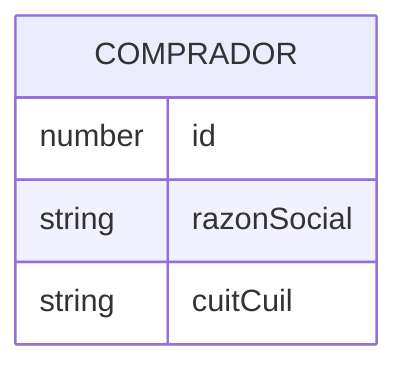

# Índice de entidades de datos

> **Proyecto:** `muvin-ms-legacy`
> **Última revisión:** 2026-04-21

## Aclaración importante

> [!info] Sin base de datos propia
> `muvin-ms-legacy` **no tiene base de datos propia**. Es un proxy que consulta datos al backend legacy externo. Las entidades documentadas aquí representan las **estructuras de datos** que fluyen a través del microservicio, no tablas de una DB local.

## Entidades manejadas

| Entidad | Descripción | Fuente | Detalle |
|---------|-------------|--------|---------|
| Comprador | Entidad de personas jurídicas/físicas compradoras | Backend legacy REST | [[entidad-comprador]] |

## Diagrama ER global

> El diagrama es simplificado. La estructura completa de `COMPRADOR` en el backend legacy puede tener más campos no expuestos por este microservicio.
