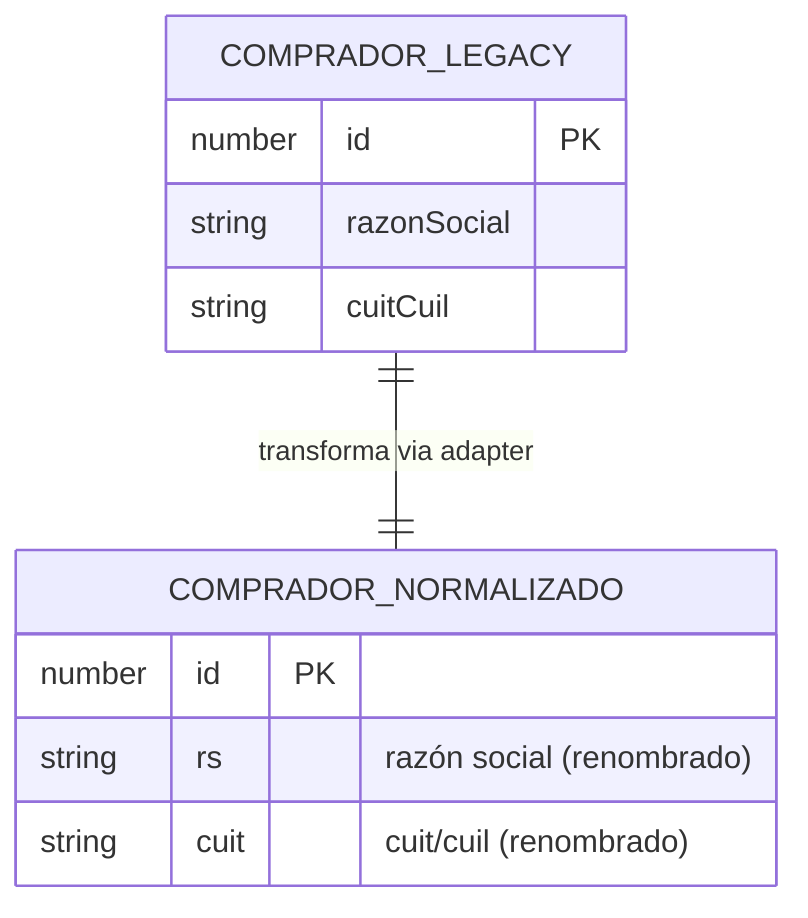

# Diagrama ER global

> **Proyecto:** `muvin-ms-legacy`
> **Última revisión:** 2026-04-21

## Diagrama

## Nota sobre el modelo

Este microservicio no gestiona un modelo relacional propio. El diagrama representa la **transformación** que ocurre entre:

1. **`COMPRADOR_LEGACY`:** la forma en que el backend REST devuelve los datos (`razonSocial`, `cuitCuil`).
2. **`COMPRADOR_NORMALIZADO`:** la forma en que el microservicio los expone a sus consumidores (`rs`, `cuit`).

Esta transformación ocurre en el adapter `response` de `src/api/queries/comprador-by-razon-social.ts`.

> Ver [[entidad-comprador]] para el detalle de campos.
