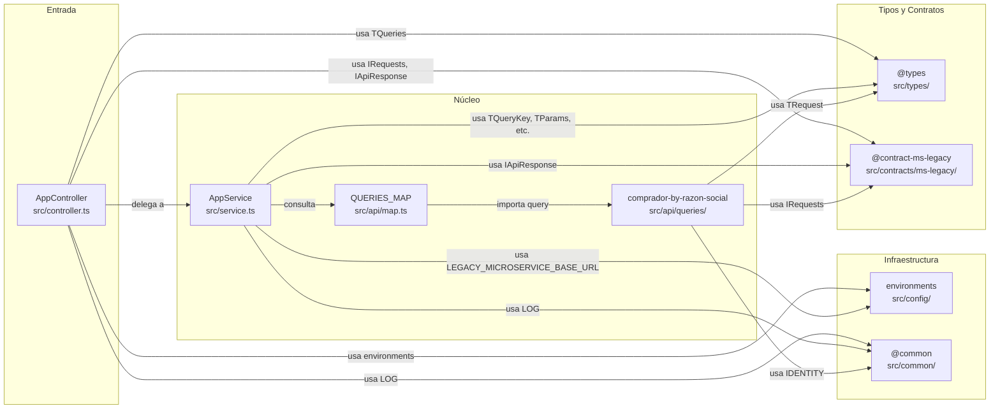

# Dependencias entre módulos

> **Proyecto:** `muvin-ms-legacy`
> **Última revisión:** 2026-04-21

## Diagrama de dependencias

## Tabla de dependencias directas por módulo

| Módulo | Depende de | Tipo de dependencia |
|--------|-----------|---------------------|
| `AppController` | `AppService` | Inyección de dependencia NestJS |
| `AppController` | `@contract-ms-legacy` | Importación de tipos TypeScript |
| `AppController` | `@types` | Importación de tipos TypeScript |
| `AppController` | `@common` (LOG) | Importación directa de función |
| `AppController` | `@config` (environments) | Importación directa de constante |
| `AppService` | `@nestjs/axios` (HttpService) | Inyección de dependencia NestJS |
| `AppService` | `QUERIES_MAP` | Importación directa de constante |
| `AppService` | `@contract-ms-legacy` | Importación de tipos TypeScript |
| `AppService` | `@types` | Importación de tipos TypeScript |
| `AppService` | `@common` (LOG) | Importación directa de función |
| `AppService` | `@config` (environments) | Importación directa de constante |
| `QUERIES_MAP` | `comprador-by-razon-social` | Importación directa |
| `comprador-by-razon-social` | `@common` (IDENTITY) | Importación directa de función |
| `comprador-by-razon-social` | `@contract-ms-legacy` | Importación de tipos TypeScript |
| `comprador-by-razon-social` | `@types` (TRequest) | Importación de tipos TypeScript |

## Dependencias circulares

> **No se detectaron dependencias circulares.** El flujo de dependencias es estrictamente unidireccional:
>
> `Controller → Service → Map → Queries → Common/Contracts/Types`

## Módulos sin dependencias (hojas del grafo)

| Módulo | Descripción |
|--------|-------------|
| `@common/identity` | Función identidad pura, sin dependencias externas |
| `@common/logger` | Solo depende de `@nestjs/common` (Logger) |
| `@config/environments` | Solo depende de `dotenv`, `joi`, `@nestjs/microservices` |
| `src/types/*` | Solo tipos TypeScript, sin dependencias en runtime |
| `src/contracts/ms-legacy/*` | Solo tipos TypeScript, sin dependencias en runtime |

## Módulos con código muerto (sin referencias activas)

| Módulo | Razón |
|--------|-------|
| `src/common/types/graphql-operation.ts` | Definido, nunca importado |
| `src/common/types/http-method.ts` | Duplicado de `src/types/methods.ts` |
| `src/common/interfaces/option.ts` | Definido, nunca importado |
| `src/common/interfaces/option-extended.ts` | Definido, nunca importado |

> Ver [[deuda-tecnica]] para el plan de limpieza.
