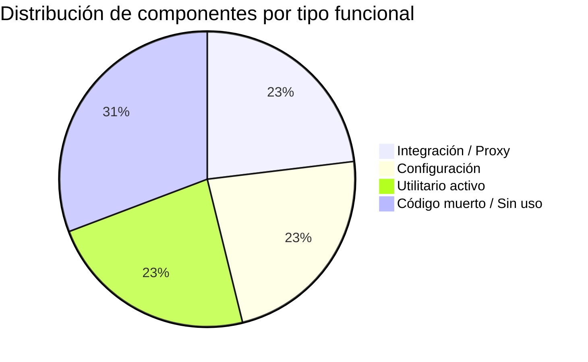

# Clasificación funcional de módulos

> **Proyecto:** `muvin-ms-legacy`
> **Última revisión:** 2026-04-21

## Tabla de clasificación

| Módulo / Componente | Tipo funcional | Descripción breve | Estado |
|---------------------|---------------|-------------------|--------|
| `AppController` | Integración (entrada) | Recibe mensajes TCP y delega al servicio | 🟢 Activo |
| `AppService` | Integración (proxy) | Hace HTTP hacia el backend legacy | 🟢 Activo |
| `AppModule` | Configuración | Registra módulos NestJS | 🟢 Activo |
| `QUERIES_MAP` (api/map) | Utilitario | Registro de queries disponibles | 🟢 Activo |
| `comprador-by-razon-social` | Integración (adapter) | Adapter para el endpoint de búsqueda de compradores | 🟢 Activo |
| `environments` (config) | Configuración | Carga y valida variables de entorno | 🟢 Activo |
| `LOG` (common/logger) | Utilitario | Logger con colores ANSI sobre NestJS Logger | 🟢 Activo |
| `IDENTITY` (common/identity) | Utilitario | Función identidad para adapters sin transformación | 🟢 Activo |
| `IOption` / `IOptionExtended` | Utilitario | Interfaces para selects/dropdowns | 💀 Sin uso detectado |
| `TGraphQlOperation` | Utilitario | Tipo para operaciones GraphQL | 💀 Código muerto |
| `THttpMethod` (common) | Utilitario | Verbos HTTP | 💀 Duplicado de `TMethod` |
| Sistema de tipos (`src/types/`) | Utilitario | Tipos genéricos del sistema de proxy | 🟢 Activo |
| Contratos (`src/contracts/`) | Configuración | API pública para consumidores del microservicio | 🟢 Activo |

## Distribución por tipo funcional

## Clasificación detallada por carpeta

| Carpeta | Tipo dominante | Observación |
|---------|---------------|-------------|
| `src/` (raíz) | Integración + Config | Núcleo del microservicio |
| `src/api/` | Integración (adapters) | Patrón Registry para mapear queries a HTTP |
| `src/common/` | Utilitario | Mix de código útil y código muerto |
| `src/config/` | Configuración | Validación de entorno con Joi |
| `src/contracts/` | Configuración / API pública | Define qué puede pedir un consumidor externo |
| `src/types/` | Utilitario (tipos) | Sistema de tipos del proxy HTTP genérico |

> [!info] Contexto
> Este microservicio no tiene funcionalidades CRUD directas, reportes ni wizards. Es un **proxy tipado** que traduce mensajes TCP a llamadas HTTP REST hacia el backend legacy de Muvin.

> [!warning] Código muerto detectado
> Al menos 4 componentes (`TGraphQlOperation`, `THttpMethod`, `IOption`, `IOptionExtended`) existen en el código pero no tienen referencias activas. Candidatos a eliminación. Ver [[deuda-tecnica]].
