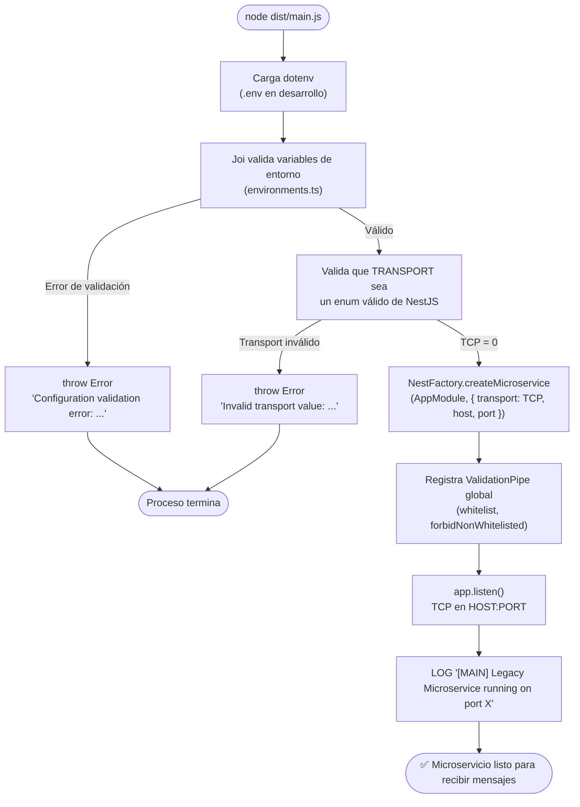

# Flujo: Bootstrap del microservicio

> **Tipo:** `flowchart TD`
> **Archivos involucrados:** `src/main.ts`, `src/config/environments.ts`, `src/module.ts`

## Descripción

Proceso de arranque del microservicio desde la invocación de `node dist/main.js` hasta que el listener TCP está activo y listo para recibir mensajes.

## Diagrama de arranque

## Variables validadas en el arranque

Ver [[modulo-config]] para la lista completa. Si alguna falta o tiene tipo incorrecto, el proceso cae con un error descriptivo **antes** de que el listener TCP se active. Este comportamiento es correcto (fail-fast).
