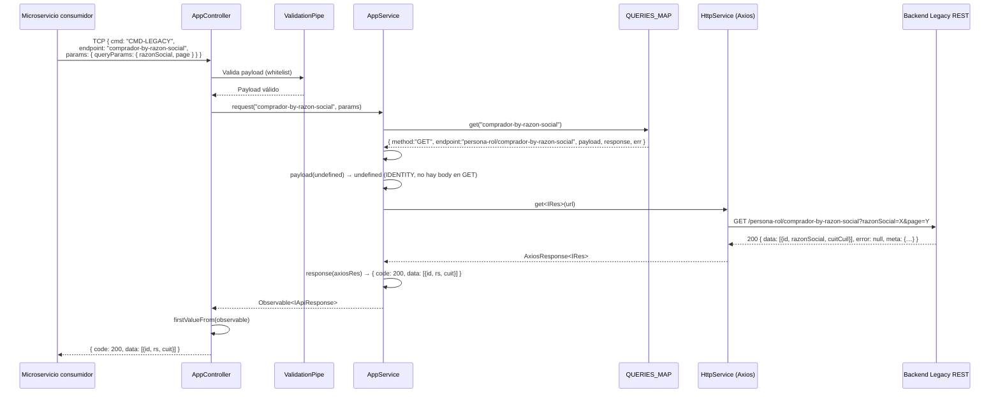
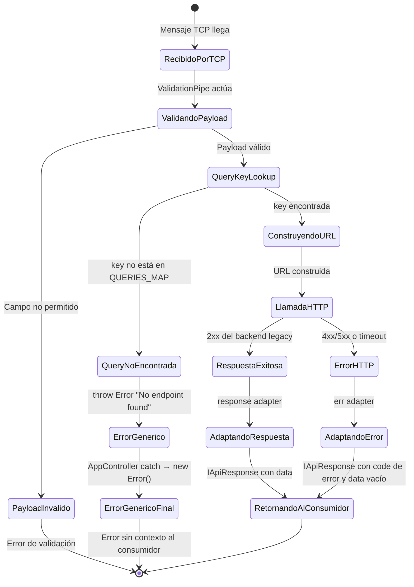

# Flujo: Request proxy end-to-end

> **Tipo:** `sequenceDiagram` + `stateDiagram-v2`
> **Módulos involucrados:** [[modulo-controller]], [[modulo-service]], [[modulo-api]], Backend Legacy

## Descripción

Ciclo de vida completo de una solicitud desde que un microservicio consumidor envía un mensaje TCP hasta que recibe la respuesta normalizada. Este flujo es el único flujo de negocio del microservicio.

## Diagrama de secuencia

## Diagrama de estados de la request

## Puntos de falla identificados

| Punto | Causa | Comportamiento actual | Severidad |
|-------|-------|----------------------|-----------|
| `ValidationPipe` rechaza | Campo extra en payload | NestJS lanza `BadRequestException` | 🟡 Manejado |
| Query key no en MAP | Clave inválida | `throw Error("No endpoint found")` → catch genérico | 🟡 |
| Backend legacy timeout (5s) | Backend caído o lento | `err adapter` → `{ code: 500, data: [] }` | 🟡 Parcialmente manejado |
| Error en el `catch` del controller | Cualquier excepción | `throw new Error()` sin contexto — perde stack trace | 🔴 |
| `console.log` del payload | Debug no sanitizado | Datos sensibles en logs del contenedor | 🔴 |
