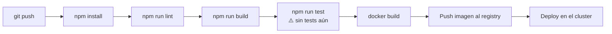

# Build y despliegue

> **Proyecto:** `muvin-ms-legacy`
> **Última revisión:** 2026-04-21

## Comandos del ciclo de vida

### Desarrollo local

```bash
# Instalar dependencias
npm install

# Arrancar con watch (recarga automática al editar)
npm run start:dev

# Verificar tipos sin compilar
npm run build
```

### Producción (sin Docker)

```bash
# Compilar TypeScript → dist/
npm run build

# Iniciar desde dist/
npm run start:prod
```

### Linting y formateo

```bash
# Lint con ESLint (flat config, eslint.config.mjs)
npm run lint

# Verificar formato con Prettier
npx prettier --check "src/**/*.ts"

# Aplicar formato
npx prettier --write "src/**/*.ts"
```

---

## Build Docker

### Construir imagen

```bash
docker build -f docker/Dockerfile -t muvin-ms-legacy:latest .
```

La imagen usa un build multi-stage:

| Stage | Base | Propósito |
|-------|------|-----------|
| `builder` | `node:20-alpine` | Instala deps completas, compila TypeScript |
| `production` | `node:20-alpine` | Solo deps de producción + `dist/` |

### Ejecutar contenedor manual

```bash
docker run -d \
  --name muvin-ms-legacy \
  --network muvin-network \
  -p 4001:4001 \
  -e LEGACY_MICROSERVICE_HOST=0.0.0.0 \
  -e LEGACY_MICROSERVICE_PORT=4001 \
  -e LEGACY_MICROSERVICE_TRANSPORT=0 \
  -e LEGACY_MICROSERVICE_CMD=CMD-LEGACY \
  -e LEGACY_MICROSERVICE_BASE_URL=https://api.muvinapp.com/api/backend/web/ \
  muvin-ms-legacy:latest
```

---

## Docker Compose (entorno local/dev)

```bash
# Levantar el servicio
docker compose -f docker/docker-compose.yml up -d

# Ver logs
docker compose -f docker/docker-compose.yml logs -f

# Detener
docker compose -f docker/docker-compose.yml down
```

> [!warning] Red externa requerida
> Asegurarse de que la red `muvin-network` exista antes de ejecutar `up`:
> ```bash
> docker network create muvin-network
> ```

---

## Verificar que el servicio está corriendo

```bash
# Ver estado del contenedor
docker ps --filter name=muvin-ms-legacy

# Ver logs del arranque
docker logs muvin-ms-legacy | tail -20
# Salida esperada: "[MAIN] Legacy Microservice running on port 4001"
```

---

## Pipeline CI/CD sugerido



> [!note] Tests pendientes
> No hay tests implementados actualmente. Ver [[deuda-tecnica]] DT-008.
