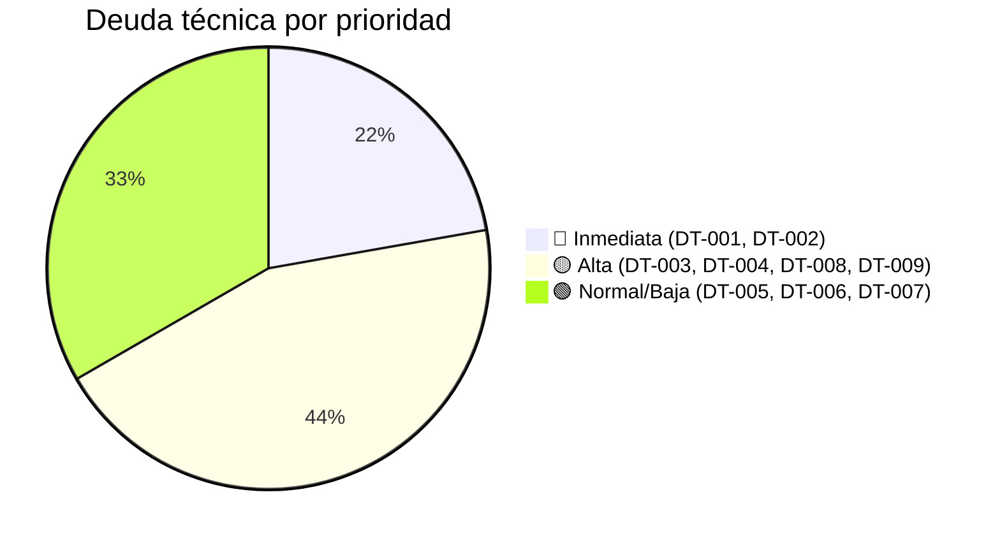

# Deuda técnica

> **Proyecto:** `muvin-ms-legacy`
> **Última revisión:** 2026-04-21
> **Priorización:** Impacto (H/M/L) × Esfuerzo (H/M/L)

## Lista priorizada

### DT-001 — `console.log` con datos sensibles en el controller

| Atributo | Valor |
|----------|-------|
| **Impacto** | Alto — datos de personas jurídicas en logs de contenedor |
| **Esfuerzo** | Bajo — reemplazar 2 líneas |
| **Prioridad** | 🔴 Inmediata |
| **Archivo** | `src/controller.ts` líneas 33 y 37 |

**Acción:** Eliminar ambos `console.log`. Si se requiere debugging, usar `LOG()` con nivel de debug controlado por variable de entorno.

---

### DT-002 — `catch` relanza error sin contexto

| Atributo | Valor |
|----------|-------|
| **Impacto** | Alto — imposible diagnosticar errores en producción |
| **Esfuerzo** | Bajo — 1-2 líneas |
| **Prioridad** | 🔴 Inmediata |
| **Archivo** | `src/controller.ts` línea 43 |

**Acción:** `throw new RpcException(error)` (NestJS RPC) o al menos `throw new Error(String(error))`.

---

### DT-003 — Endpoint `comprador-by-cuit` declarado sin implementar

| Atributo | Valor |
|----------|-------|
| **Impacto** | Medio — inconsistencia en tipos; puede confundir a desarrolladores |
| **Esfuerzo** | Medio — crear query, registrar en map, agregar a IRequests |
| **Prioridad** | 🟡 Alta |
| **Archivos** | `src/types/endpoints.ts`, `src/api/`, `src/contracts/ms-legacy/requests.ts` |

**Acción:** O implementar la query completa (siguiendo el patrón de `comprador-by-razon-social`) o eliminar `persona-rol/comprador-by-cuit` de `TEndpoint` hasta que sea necesaria.

---

### DT-004 — Paginación no propagada al consumidor

| Atributo | Valor |
|----------|-------|
| **Impacto** | Medio — el consumidor no puede paginar correctamente |
| **Esfuerzo** | Bajo — poblar `IApiResponse.meta` en el adapter |
| **Prioridad** | 🟡 Alta |
| **Archivo** | `src/api/queries/comprador-by-razon-social.ts` (función `response`) |

**Acción:** Mapear `res.data.meta.total → pages`, `res.data.meta.page → current`, `res.data.meta.count → items` en la respuesta normalizada.

```typescript
// Adapter actual
function response(res: AxiosResponse<TRes>): TResult {
  return {
    code: res.status ?? 500,
    data: res.data.data.map(({ id, cuitCuil, razonSocial }) => ({
      id, rs: razonSocial, cuit: cuitCuil,
    })),
    // ← falta: meta: { pages: res.data.meta.total, current: res.data.meta.page, items: res.data.meta.count }
  };
}
```

---

### DT-005 — Código muerto en `src/common/`

| Atributo | Valor |
|----------|-------|
| **Impacto** | Bajo — confusión para nuevos desarrolladores |
| **Esfuerzo** | Bajo — eliminar 4 archivos + actualizar barrel |
| **Prioridad** | 🟢 Normal |
| **Archivos** | `graphql-operation.ts`, `http-method.ts`, `option.ts`, `option-extended.ts` |

**Acción:** Eliminar los 4 archivos y sus exports del barrel `_index.ts`.

---

### DT-006 — `noImplicitAny: false` en tsconfig

| Atributo | Valor |
|----------|-------|
| **Impacto** | Bajo — reduce la seguridad del tipado |
| **Esfuerzo** | Medio — puede requerir agregar tipos explícitos en algunos lugares |
| **Prioridad** | 🟢 Normal |
| **Archivo** | `tsconfig.json` |

**Acción:** Habilitar `"noImplicitAny": true` y resolver los errores de compilación resultantes.

---

### DT-007 — `transportFn` con lógica semánticamente invertida

| Atributo | Valor |
|----------|-------|
| **Impacto** | Bajo — código confuso, no introduce bug real |
| **Esfuerzo** | Bajo — renombrar o invertir la condición |
| **Prioridad** | 🟢 Baja |
| **Archivo** | `src/config/environments.ts` |

**Acción:** Renombrar a `isInvalidTransport` o invertir la lógica para que retorne `true` cuando el transporte ES válido.

---

### DT-008 — Sin tests unitarios ni de integración

| Atributo | Valor |
|----------|-------|
| **Impacto** | Alto — cualquier cambio puede romper el proxy sin detectarlo |
| **Esfuerzo** | Medio — crear specs para controller, service y queries |
| **Prioridad** | 🟡 Alta |
| **Carpeta afectada** | `src/` (no hay archivos `.spec.ts`) |

**Acción:** Crear tests unitarios con mocks de HttpService para `AppService.request()`, y tests de integración del flujo completo usando `@nestjs/testing`.

---

### DT-009 — Base image Node.js 20 próxima a EOL

| Atributo | Valor |
|----------|-------|
| **Impacto** | Medio — sin soporte de seguridad tras la EOL |
| **Esfuerzo** | Bajo — cambiar la versión en el Dockerfile |
| **Prioridad** | 🟡 Alta |
| **Archivo** | `docker/Dockerfile` |

**Acción:** Migrar a `node:22-alpine` (LTS hasta 2027).

---

## Resumen de deuda por prioridad


