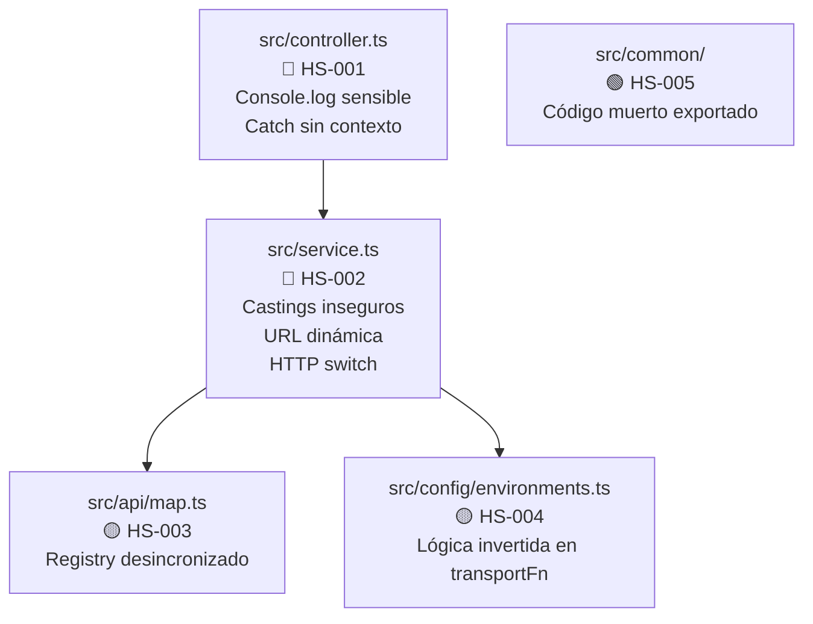

# Hotspots de riesgo

> **Proyecto:** `muvin-ms-legacy`
> **Última revisión:** 2026-04-21
> **Definición de hotspot:** archivo o componente con alta concentración de riesgo, complejidad o responsabilidad.

## Hotspots identificados

### 🔴 HS-001 — `src/controller.ts`

**Razón:** Es el punto de entrada único del microservicio. Concentra:
- Los `console.log` que exponen datos sensibles (SEC-001).
- El `catch` que pierde el contexto de error (SEC-002).
- La lógica de conversión de Observable a Promise (`firstValueFrom`).

**Cambio de alto impacto:** cualquier error aquí afecta a todos los consumidores del microservicio.

---

### 🔴 HS-002 — `src/service.ts`

**Razón:** Concentra toda la lógica de proxy HTTP. Es el archivo más complejo del proyecto y tiene:
- Castings `as unknown as T` que evaden el sistema de tipos.
- Construcción dinámica de URL.
- Manejo de múltiples métodos HTTP.
- Composición de pipes RxJS.

**Cambio de alto impacto:** un error en `#url()` o en el switch de métodos afecta a todas las queries.

---

### 🟡 HS-003 — `src/api/map.ts` + `src/api/queries/`

**Razón:** Es el registro central de funcionalidad. Actualmente tiene una sola entrada. Si crece sin disciplina (sin tests, sin typing estricto), puede volverse difícil de mantener.

**Riesgo:** el `TEndpoint` ya declara un segundo endpoint sin implementar, lo que indica que el registro está desincronizado con los tipos.

---

### 🟡 HS-004 — `src/config/environments.ts`

**Razón:** Si la validación de Joi falla silenciosamente (ej. por una versión incompatible de Joi), el servicio podría arrancar con configuración inválida. La función `transportFn` tiene lógica invertida (devuelve `true` cuando el transporte es **inválido**), lo que es confuso.

---

### 🟢 HS-005 — `src/common/` (código muerto)

**Razón:** El `barrel export` en `src/common/_index.ts` exporta tipos que no se usan en ningún lugar del proyecto. Aunque el impacto es bajo, contamina el namespace y puede confundir a nuevos desarrolladores.

## Mapa visual de hotspots

