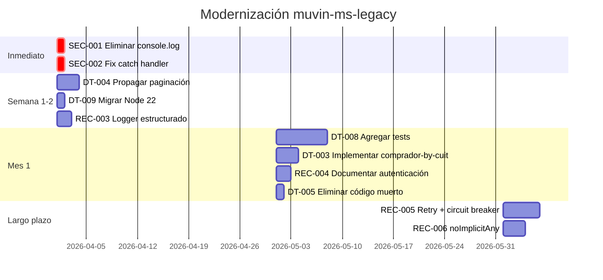

# Recomendaciones de modernización

> **Proyecto:** `muvin-ms-legacy`
> **Última revisión:** 2026-04-21
> **Audiencia:** Tech Lead, Arquitectura

## Estado actual vs. estado objetivo

| Dimensión | Estado actual | Estado objetivo |
|-----------|--------------|-----------------|
| Runtime | Node 20 (próximo a EOL) | Node 22 LTS |
| Validación HTTP payload | Sin validación de query params | DTO con `class-validator` |
| Error handling | `throw new Error()` sin contexto | `RpcException` con causa |
| Testing | Sin tests | Cobertura mínima del 80% |
| Logging | `console.log` sin control | Logger estructurado por nivel |
| Autenticación | Desconocida/ausente | Token Bearer o API Key documentado |
| Resiliencia | Sin retry ni circuit breaker | Retry con backoff; circuit breaker |

---

## REC-001 — Migrar a Node 22 LTS

**Urgencia:** Alta

Node 20 alcanza EOL en abril 2026. Node 22 es LTS hasta abril 2027.

```dockerfile
# Cambio en docker/Dockerfile
FROM node:22-alpine AS builder
```

Riesgo de regresión: muy bajo. La API de Node entre 20 y 22 es compatible.

---

## REC-002 — Agregar DTOs para validación de parámetros de entrada

**Urgencia:** Media

Actualmente los `queryParams` y `bodyParams` de cada endpoint no tienen validación de formato en tiempo de ejecución.

**Implementación sugerida:**

```typescript
// src/contracts/ms-legacy/dtos/comprador-by-razon-social.dto.ts
import { IsString, IsInt, Min, MaxLength } from 'class-validator';

export class CompradorByRazonSocialDto {
  @IsString()
  @MaxLength(200)
  razonSocial: string;

  @IsInt()
  @Min(1)
  page: number;
}
```

Integrar con el ValidationPipe existente (ya habilitado globalmente).

---

## REC-003 — Implementar logging estructurado

**Urgencia:** Alta (por SEC-001)

Reemplazar todos los `console.log` por un logger configurable que:
- Soporte niveles: `debug`, `info`, `warn`, `error`.
- Sea suprimible con variable de entorno (`LOG_LEVEL`).
- No registre datos sensibles (o los enmascare).

NestJS ya tiene `Logger` incorporado:

```typescript
import { Logger } from '@nestjs/common';
const logger = new Logger('AppController');

// En lugar de console.log(payload)
logger.debug(`Request endpoint: ${payload.endpoint}`);  // sin datos sensibles
```

---

## REC-004 — Investigar y documentar autenticación al backend legacy

**Urgencia:** Alta (por SEC-003)

Antes de cualquier otro trabajo, determinar si el backend legacy requiere autenticación. Las opciones típicas son:

1. **API Key via header:** `X-Api-Key: <valor>` → variable de entorno + `HttpModule` interceptor.
2. **Bearer token:** `Authorization: Bearer <token>` → igual.
3. **IP whitelist / VPN:** no requiere cambios en código, pero debe documentarse.
4. **Sin autenticación:** documentar explícitamente que es una decisión consciente.

---

## REC-005 — Agregar retry y circuit breaker

**Urgencia:** Baja (nice-to-have)

El servicio no tiene resiliencia ante fallas transitorias del backend legacy. Si el backend legacy falla temporalmente, la request falla inmediatamente.

**Opciones:**
- `rxjs` retry con backoff: `retry({ count: 3, delay: (_, i) => timer(i * 500) })`
- `opossum` (circuit breaker): para degradación graceful.

---

## REC-006 — Habilitar `noImplicitAny` en TypeScript

**Urgencia:** Baja

Migración incremental:
1. Ejecutar `tsc --noEmitOnError false --noImplicitAny` para ver los errores.
2. Agregar tipos explícitos uno a uno.
3. Habilitar en `tsconfig.json`.

---

## Roadmap sugerido


