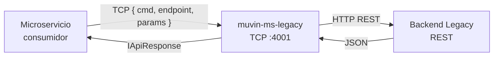

# muvin-ms-legacy — Documentación técnica

> **Versión:** 1.0.0 | **Última revisión:** 2026-04-21
> **Estado del sistema:** Producción (con deuda técnica crítica pendiente)

## ¿Qué es este sistema?

Microservicio proxy TCP→HTTP del ecosistema Muvin. Traduce mensajes TCP de microservicios internos hacia el backend legacy REST externo, normalizando las respuestas al contrato estándar del ecosistema.

## Metadatos del proyecto

| Campo | Valor |
|-------|-------|
| Nombre del paquete | `muvin-ms-legacy` |
| Framework | NestJS 11 / TypeScript 5.7 |
| Transport | TCP (`Transport.TCP = 0`) |
| Puerto | 4001 |
| Node.js | 20.x (⚠️ próximo a EOL; migrar a 22) |
| Repositorio | `c:\Proyectos\bcr-muvin\ms-legacy` |
| Queries implementadas | 1 / 2 declaradas |
| Tests | ❌ Sin cobertura |
| Hallazgos críticos de seguridad | 2 |

---

## ⚠️ Alertas activas

> [!danger] SEC-001 — `console.log` con datos sensibles
> `src/controller.ts` líneas 33 y 37 exponen el payload TCP y la respuesta del backend en los logs del contenedor. Ver [[security-inventory]].

> [!danger] DT-002 — `catch` relanza error sin contexto
> El bloque catch del controller lanza `new Error()` sin mensaje ni causa. Los errores en producción son imposibles de diagnosticar. Ver [[deuda-tecnica]].

---

## Estructura de la documentación

### 00 — Overview
| Archivo | Descripción |
|---------|-------------|
| [[vision-general]] | Qué hace el sistema, posición en el ecosistema, estado actual |
| [[arquitectura-alto-nivel]] | Diagrama de arquitectura, patrones, capas |
| [[stack-tecnologico]] | Dependencias, versiones, clasificación |
| [[glosario]] | Términos del dominio y técnicos |

### 01 — Módulos
| Archivo | Descripción |
|---------|-------------|
| [[_indice-modulos]] | Índice de todos los módulos |
| [[modulo-controller]] | AppController — punto de entrada TCP |
| [[modulo-service]] | AppService — proxy HTTP y registry |
| [[modulo-api]] | QUERIES_MAP, interfaces, adapters |
| [[modulo-config]] | Variables de entorno, validación Joi |
| [[modulo-common]] | Código muerto y utilitarios |
| [[modulo-contracts]] | Contratos de API (IApiResponse, IRequests) |
| [[modulo-types]] | Tipos transversales del sistema |

### 02 — Funcionalidades
| Archivo | Descripción |
|---------|-------------|
| [[_indice-funcionalidades]] | Lista de funcionalidades implementadas |
| [[api-comprador-by-razon-social]] | Búsqueda de compradores por razón social |

### 03 — Servicios backend
| Archivo | Descripción |
|---------|-------------|
| [[_indice-servicios]] | Lista de endpoints del backend legacy |
| [[persona-rol-endpoints]] | Endpoints del recurso `persona-rol` |

### 04 — Modelo de datos
| Archivo | Descripción |
|---------|-------------|
| [[_indice-entidades]] | Índice de entidades documentadas |
| [[diagrama-er-global]] | Diagrama ER del sistema |
| [[entidad-comprador]] | Entidad Comprador (raw, normalizada, paginación) |

### 05 — Inventarios
| Archivo | Descripción |
|---------|-------------|
| [[tree-estructura-archivos]] | Árbol de archivos con clasificación |
| [[functional-classification]] | Clasificación funcional de archivos |
| [[cross-module-dependencies]] | Dependencias entre módulos |
| [[depends-matrix]] | Matriz de dependencias |
| [[core-vs-custom-dependencies]] | Dependencias core vs. custom |
| [[security-inventory]] | Inventario de hallazgos de seguridad |

### 06 — Flujos transversales
| Archivo | Descripción |
|---------|-------------|
| [[_indice-flujos]] | Índice de flujos documentados |
| [[flujo-request-proxy]] | Flujo end-to-end de una request |
| [[flujo-bootstrap]] | Proceso de arranque del microservicio |

### 07 — Operación y despliegue
| Archivo | Descripción |
|---------|-------------|
| [[requisitos-entorno]] | Versiones de runtime, variables de entorno |
| [[build-y-despliegue]] | Comandos de build, Docker, CI/CD |
| [[configuracion]] | Todas las variables de entorno documentadas |

### 08 — Riesgos y deuda técnica
| Archivo | Descripción |
|---------|-------------|
| [[hotspots]] | Archivos con alta concentración de riesgo |
| [[deuda-tecnica]] | Lista priorizada de deuda técnica (9 items) |
| [[recomendaciones-modernizacion]] | Roadmap de modernización |

---

## Convenciones de esta documentación

| Convención | Significado |
|------------|-------------|
| `[[archivo]]` | Link interno de Obsidian |
| `🔴` | Crítico / Inmediato |
| `🟡` | Alta / Media |
| `🟢` | Baja / OK |
| `💀` | Código muerto |
| `⚠️` | Advertencia de deuda técnica |
| `> [!warning]` | Nota de advertencia Obsidian |
| `> [!danger]` | Nota de peligro Obsidian |
| `> [!note]` | Nota informativa Obsidian |
