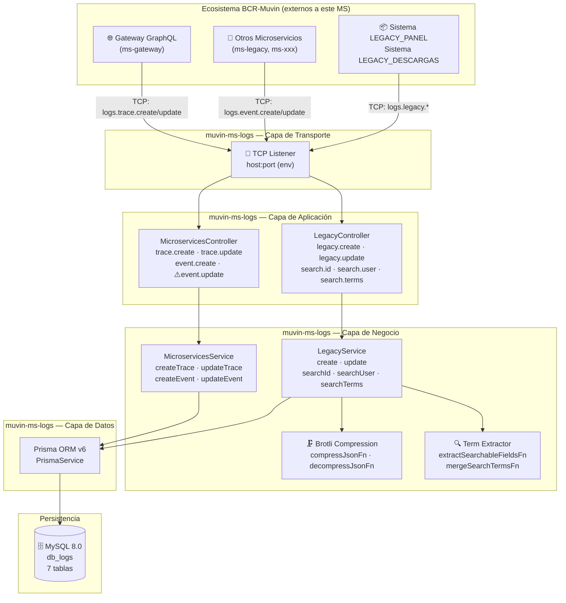
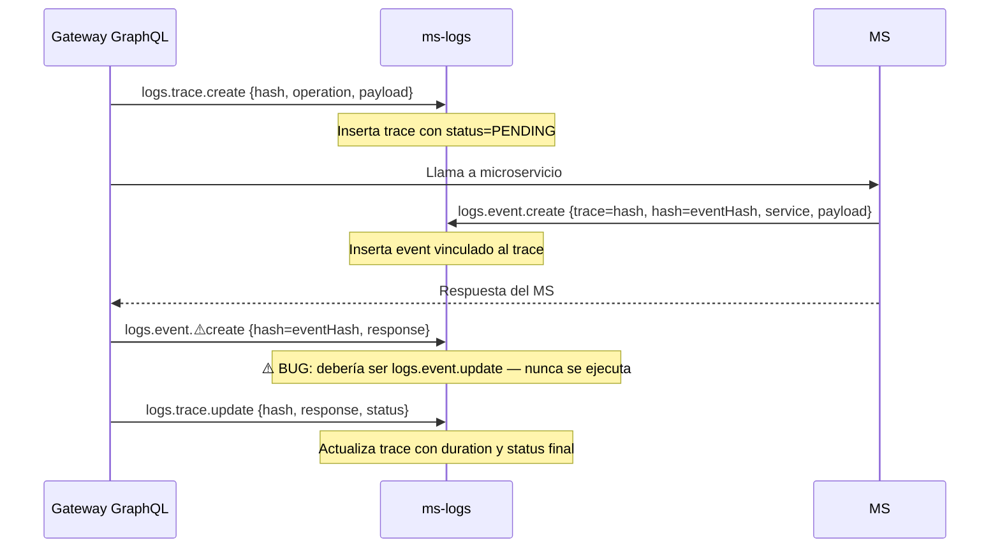
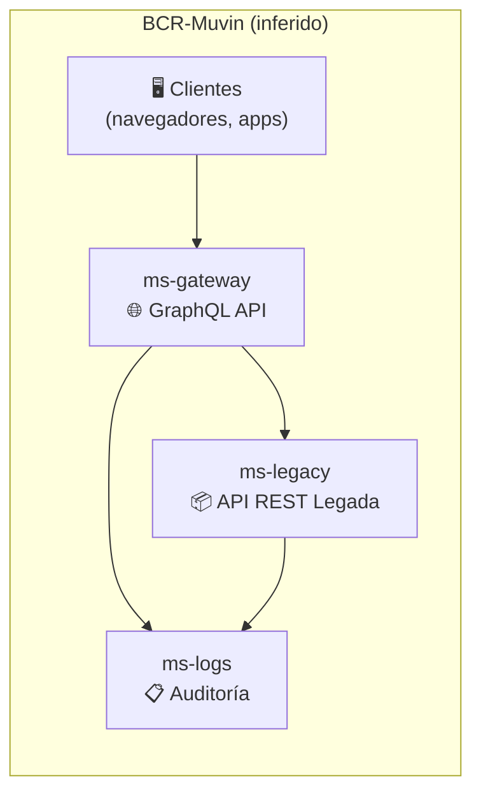

# Arquitectura de Alto Nivel — `muvin-ms-logs`

> **Última revisión:** 2026-04-21
> **Tipo de diagrama:** `graph TD` (capas)

---

## Descripción del sistema

`muvin-ms-logs` es un **microservicio de auditoría y logging** dentro del ecosistema BCR-Muvin. No expone endpoints HTTP ni interfaz de usuario. Opera exclusivamente como **receptor TCP de mensajes** provenientes de otros servicios del ecosistema.

Su responsabilidad es registrar dos tipos de eventos:

1. **Trazas GraphQL** (`traces` + `events`): el gateway GraphQL registra cada operación y cada llamada a microservicios como un par traza-evento correlacionados por un `hash`.
2. **Requests legacy** (`legacy_panel` + `legacy_descargas`): los sistemas legados registran cada request HTTP a sus APIs para auditoría, con búsqueda posterior por ID, usuario o términos de negocio.

---

## Diagrama de arquitectura — capas

---

## Descripción de cada capa

### 1. Capa de Transporte (TCP)
- El MS arranca como un **NestJS Microservice** (no como aplicación HTTP).
- Escucha en `LOGS_MICROSERVICE_HOST:LOGS_MICROSERVICE_PORT` usando el transporte configurado en `LOGS_MICROSERVICE_TRANSPORT`.
- Todos los mensajes entrantes son **fire-and-forget** para operaciones de escritura (create/update): el caller no espera respuesta.
- Las operaciones de **búsqueda** (search.*) sí devuelven respuesta.

### 2. Capa de Aplicación (Controllers)
- `MicroservicesController`: maneja 4 message patterns para traces y events.
- `LegacyController`: maneja 5 message patterns para el sistema legado.
- Los controllers **no hacen validación de negocio** — delegan inmediatamente al service.
- Usan `ValidationPipe` global con `whitelist: true` y `forbidNonWhitelisted: true`.

### 3. Capa de Negocio (Services)
- `MicroservicesService`: CRUD directo sobre tablas `traces` y `events`. Sin lógica especial.
- `LegacyService`: lógica más compleja — upsert de acciones, compresión de payloads, extracción de términos de búsqueda, correlación por `hash`.
- Los errores en operaciones de escritura se **capturan silenciosamente** con `console.log` (no se propagan). Ver [[deuda-tecnica]].

### 4. Capa de Datos (Prisma + MySQL)
- `PrismaService` extiende `PrismaClient` e implementa `OnModuleInit`.
- **Problema:** cada módulo (`MicroservicesModule`, `LegacyModule`) instancia su propio `PrismaService` como provider — hay dos instancias del cliente Prisma. Ver [[deuda-tecnica]].

---

## Flujo de correlación traza-evento

> ⚠️ El paso de `event.update` nunca se ejecuta correctamente debido al bug en `constant.ts`. Ver [[deuda-tecnica#bug-event-update]].

---

## Posición en el ecosistema

> ⚠️ Los servicios externos (`ms-gateway`, `ms-legacy`) son **inferidos** del código — no están disponibles en este workspace. Los nombres y relaciones son aproximaciones. Marcar como 🚧 hasta verificación.

---

*Ver también: [[stack-tecnologico]] · [[cross-module-dependencies]] · [[flujo-tracing-graphql]] · [[flujo-legacy-logging]]*
