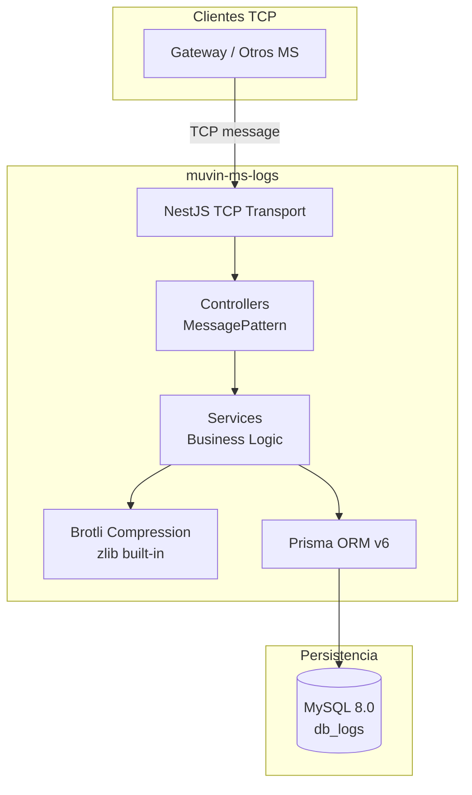

# Stack Tecnológico — `muvin-ms-logs`

> **Última revisión:** 2026-04-21
> **Fuente de verdad:** `package.json`, `prisma/schema.prisma`, `docker/docker-compose.yml`

---

## Runtime y lenguaje

| Tecnología | Versión declarada | Propósito | Estado vendor | Riesgo |
|------------|-------------------|-----------|---------------|--------|
| **Node.js** | ≥ 22 (inferido por `@types/node ^22`) | Runtime de ejecución | ✅ LTS activo | 🟢 Bajo |
| **TypeScript** | `^5.7.3` | Lenguaje principal | ✅ Vigente | 🟢 Bajo |

---

## Framework principal

| Tecnología | Versión declarada | Propósito | Estado vendor | Riesgo |
|------------|-------------------|-----------|---------------|--------|
| **NestJS** (`@nestjs/common`, `@nestjs/core`) | `^11.0.1` | Framework de aplicación | ✅ Vigente (v11, 2025) | 🟢 Bajo |
| **NestJS Microservices** (`@nestjs/microservices`) | `^11.1.6` | Transporte TCP | ✅ Vigente | 🟢 Bajo |
| **NestJS Platform Express** | `^11.0.1` | Plataforma HTTP (no usada activamente) | ✅ Vigente | 🟡 Incluida pero innecesaria |
| **RxJS** | `^7.8.1` | Programación reactiva (usado internamente por NestJS) | ✅ Vigente | 🟢 Bajo |

> ⚠️ `@nestjs/platform-express` está declarado como dependencia pero el MS no expone ningún endpoint HTTP — solo escucha en TCP. Posible dependencia residual o requerida internamente por NestJS.

---

## Base de datos y ORM

| Tecnología | Versión declarada | Propósito | Estado vendor | Riesgo |
|------------|-------------------|-----------|---------------|--------|
| **MySQL** | `8.0` (imagen Docker) | Base de datos relacional | ✅ Vigente | 🟢 Bajo |
| **Prisma ORM** (`prisma` + `@prisma/client`) | `^6.16.1` | ORM y migrations | ✅ Vigente (v6, 2025) | 🟢 Bajo |

---

## Transporte de mensajes

| Tecnología | Configuración | Propósito | Estado vendor | Riesgo |
|------------|---------------|-----------|---------------|--------|
| **TCP (NestJS built-in)** | Configurable por env var `LOGS_MICROSERVICE_TRANSPORT` | Comunicación inter-servicios | ✅ Built-in NestJS | 🟡 Sin autenticación en el canal |

> ⚠️ El transporte es configurable (acepta TCP, Redis, NATS, MQTT, gRPC, RMQ, Kafka) pero en producción se usa **TCP puro**, que no tiene autenticación ni cifrado inherente. Ver [[security-inventory]].

---

## Validación y transformación

| Tecnología | Versión declarada | Propósito | Estado vendor | Riesgo |
|------------|-------------------|-----------|---------------|--------|
| **class-validator** | `^0.14.2` | Validación de DTOs en pipes | ✅ Vigente | 🟢 Bajo |
| **class-transformer** | `^0.5.1` | Transformación de objetos | ✅ Vigente | 🟢 Bajo |
| **Joi** | `^18.0.1` | Validación de variables de entorno | ✅ Vigente | 🟢 Bajo |
| **dotenv** | `^17.2.2` | Carga de `.env` | ✅ Vigente | 🟢 Bajo |

---

## Compresión

| Tecnología | Versión | Propósito | Estado vendor | Riesgo |
|------------|---------|-----------|---------------|--------|
| **Brotli** (Node.js built-in `zlib`) | Built-in Node 22 | Compresión de payloads JSON en BD (calidad 11) | ✅ Built-in | 🟢 Bajo |

> ℹ️ Los payloads de `legacy_panel` y `legacy_descargas` se almacenan comprimidos con Brotli (calidad máxima = 11). No se pueden leer directamente desde la BD sin descomprimir. Ver [[entidad-legacy]].

---

## Tooling de desarrollo

| Tecnología | Versión declarada | Propósito | Estado vendor | Riesgo |
|------------|-------------------|-----------|---------------|--------|
| **NestJS CLI** | `^11.0.0` | Scaffolding y build | ✅ Vigente | 🟢 Bajo |
| **Jest** | `^30.0.0` | Testing | ✅ Vigente | 🟢 Bajo |
| **ts-jest** | `^29.2.5` | Ejecutar tests TypeScript | ✅ Vigente | 🟢 Bajo |
| **ESLint** | `^9.18.0` | Linting (flat config) | ✅ Vigente | 🟢 Bajo |
| **Prettier** | `^3.4.2` | Formateo de código | ✅ Vigente | 🟢 Bajo |
| **Husky** | `^9.1.7` | Git hooks | ✅ Vigente | 🟢 Bajo |
| **lint-staged** | `^16.2.3` | Lint en staged files | ✅ Vigente | 🟢 Bajo |
| **typescript-transform-paths** | `^3.5.5` | Resolución de path aliases en build | ✅ Vigente | 🟢 Bajo |

---

## Infraestructura

| Tecnología | Versión | Propósito | Estado vendor | Riesgo |
|------------|---------|-----------|---------------|--------|
| **Docker** | No especificada | Contenedorización | ✅ Vigente | 🟢 Bajo |
| **Docker Compose** | `3.8` | Orquestación local | ✅ Vigente | 🟡 MS comentado en compose |

---

## Diagrama de capas tecnológicas

---

## Resumen de riesgos del stack

| Área | Riesgo | Severidad |
|------|--------|-----------|
| Transporte TCP sin TLS | Canal de comunicación no cifrado | 🟡 Medio |
| `@nestjs/platform-express` innecesario | Superficie de ataque potencial, dependencia de peso extra | 🟡 Bajo-Medio |
| Sin tests detectados | Cero cobertura de test | 🔴 Alto |
| MS comentado en Docker Compose | No se puede desplegar el MS de forma orquestada | ⚠️ Operativo |

---

*Ver también: [[vision-general]] · [[arquitectura-alto-nivel]] · [[deuda-tecnica]] · [[security-inventory]]*
