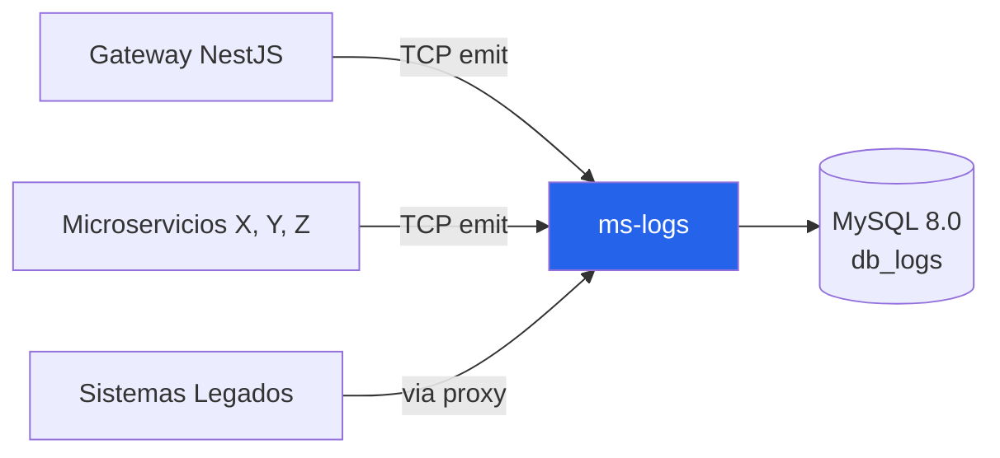

# Visión General — muvin-ms-logs

> **Versión:** 0.0.1 · **Runtime:** Node.js 22 + NestJS 11 + Prisma 6 · **BD:** MySQL 8.0

## ¿Qué es este servicio?

`ms-logs` es el **microservicio de auditoría y trazabilidad** del ecosistema BCR-Muvin. Centraliza tres tipos de logs:

1. **Trazas GraphQL** — ciclo de vida de cada operación GraphQL del gateway (qué, quién, cuánto tardó)
2. **Eventos de microservicio** — llamadas individuales a microservicios durante la resolución de una operación
3. **Logs legacy** — requests HTTP hacia los sistemas legados PANEL y DESCARGAS

No expone HTTP. Es un servicio **TCP puro** — los callers usan `ClientProxy` de NestJS con `emit()` (fire & forget) o `send()` (request-response).

## Posición en el ecosistema

## Estructura de datos principal

3 grupos de tablas:
- `traces` + `events` → observabilidad GraphQL
- `legacy_panel` + `legacy_descargas` + `legacy_actions` + `legacy_user_actions` + `users` → logs legados

## Estado actual (honesto)

| Aspecto | Estado |
|---------|--------|
| Funcionalidad core | 🟡 Parcialmente roto — `event.update` nunca se ejecuta |
| Tests | 🔴 0 tests |
| Observabilidad | 🟡 Solo `console.log` — sin structured logging |
| Seguridad | 🟡 TCP sin auth/TLS (red interna) |
| Despliegue Docker | 🟡 MS comentado en docker-compose |

## Links rápidos

- [[stack-tecnologico]] — Stack completo con versiones
- [[arquitectura-alto-nivel]] — Diagramas de arquitectura
- [[_indice-modulos]] — Módulos del MS
- [[_indice-funcionalidades]] — Las 9 funcionalidades detalladas
- [[message-patterns-endpoints]] — Todos los patterns TCP con payloads
- [[diagrama-er-global]] — Modelo de datos completo ([[_indice-entidades]])
- [[deuda-tecnica]] — Bugs y deuda priorizada
- [[requisitos-entorno]] — Cómo levantar el servicio

---

*Ver también: [[glosario]] · [[README]]*
