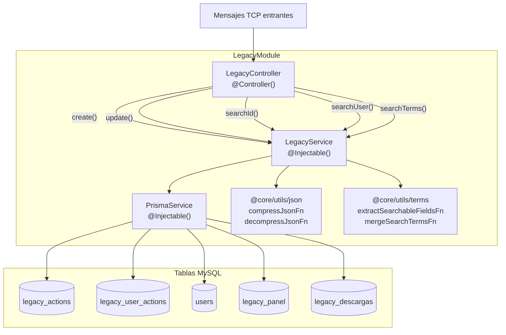
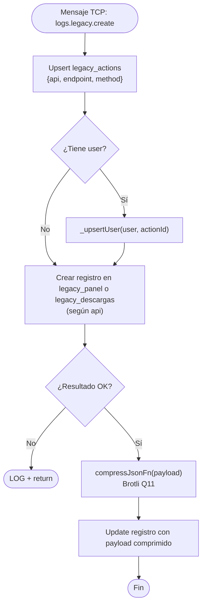

# Módulo: Legacy

> **Ruta/Namespace:** `src/modules/legacy/`
> **Responsable histórico:** ⚠️ Pendiente de verificar
> **Criticidad:** 🔴 Alta
> **Estado:** Activo

## Propósito

Registra y permite consultar los **requests HTTP** realizados contra los sistemas legados `LEGACY_PANEL` y `LEGACY_DESCARGAS`. A diferencia del módulo Microservices, este módulo tiene funcionalidad bidireccional: recibe registros para persistir **y** responde consultas de búsqueda. Los payloads se almacenan comprimidos (Brotli Q11) para optimizar espacio. Además, extrae automáticamente términos de búsqueda del dominio de negocio (cupos, CTG, carta de porte, transportistas) para búsqueda full-text posterior.

## Funcionalidades que expone

| # | Funcionalidad | Descripción breve | Detalle |
|---|---------------|-------------------|---------|
| 2.1 | Crear registro legacy | Registra un request HTTP al sistema legado con payload comprimido | [[legacy-create]] |
| 2.2 | Actualizar registro legacy | Completa el registro con respuesta, código HTTP y duración | [[legacy-update]] |
| 2.3 | Buscar por ID | Recupera un registro legacy descomprimiendo su payload/response | [[legacy-search-id]] |
| 2.4 | Buscar por usuario | Lista registros de un usuario para un endpoint+método, con paginación | [[legacy-search-user]] |
| 2.5 | Buscar por términos | Búsqueda semántica por campos de negocio extraídos del payload | [[legacy-search-terms]] |

## Dependencias

- **Depende de:** `PrismaService`, `@common` (CMDS, EStatus, LOG), `@core` (compressJsonFn, decompressJsonFn, extractSearchableFieldsFn, mergeSearchTermsFn), `@contract-ms-logs` (TContractMsLogs, EApi), `@contract-ms-legacy` (IApiResponse)
- **Es usado por:** Clientes TCP externos (ms-gateway, sistemas legados, paneles de administración)
- **Consume servicios backend:** No aplica — solo persiste y consulta datos locales

## Diagrama de componentes internos

## Message Patterns (TCP)

| Pattern | Handler | Tipo operación | Devuelve respuesta |
|---------|---------|----------------|-------------------|
| `logs.legacy.create` | `create()` | Escritura — fire & forget | ❌ No (`void`) |
| `logs.legacy.update` | `update()` | Escritura — fire & forget | ❌ No (`void`) |
| `logs.legacy.search.id` | `searchId()` | Lectura | ✅ Sí (registro o `null`) |
| `logs.legacy.search.user` | `searchUser()` | Lectura paginada | ✅ Sí (lista o error) |
| `logs.legacy.search.terms` | `searchTerms()` | Lectura | ✅ Sí (lista) |

## Flujo interno de `create()` (el más complejo)

## Lógica de extracción de términos de búsqueda

El módulo extrae automáticamente campos de negocio del dominio agrícola-comercial del payload/response:

| Campo extraído | Aliases reconocidos |
|---------------|---------------------|
| `cupo` | `id_cupo`, `cupo`, `idCupo`, `cupoId`, `cupo_id` |
| `ctg` | `ctg`, `CTG` |
| `cartaPorte` | `id_carta_porte`, `cartaPorte`, `idCartaPorte`, `carta_porte` |
| `transportista` | `id_cuit_transportista`, `cuitTransportista`, `transportista_cuit` |
| `chofer` | `id_cuit_chofer`, `cuitChofer`, `chofer_cuit` |
| `dominio` | `dominio` |
| `cosecha` | `cosecha` |
| `grano` | `grano` |
| `destino` | `id_destino`, `destino`, `idDestino` |
| … | (ver `src/core/utils/terms.ts` para lista completa) |

Los términos se almacenan como `VARCHAR` en `search_terms` para búsqueda rápida por `LIKE`.

## Entidades de datos implicadas

[[entidad-legacy]], [[entidad-users]]

## Riesgos y deuda técnica detectados

- ⚠️ Errores en create/update se capturan silenciosamente con `LOG + return` — no hay alertas ni reintentos
- ⚠️ `searchUser` devuelve objetos con estructura `{ data: [], errors: { message } }` inconsistente con `IApiResponse` — respuesta de error no tipada formalmente
- ⚠️ `duration` en `update()` se calcula como segundos enteros (`Math.floor(ms/1000)`) pero el campo en BD es `Int` etiquetado como "ms" en el schema. Inconsistencia de unidad. Ver [[deuda-tecnica]].
- ⚠️ `PrismaService` instanciado localmente — dos instancias en el proceso (ver [[modulo-microservices]])
- 💀 `@contract-ms-legacy/interfaces/comprador-by-razon-social.ts` aparece en el módulo de contratos pero no tiene uso detectado

## Archivos fuente relevantes

- `src/modules/legacy/controller.ts`
- `src/modules/legacy/service.ts`
- `src/modules/legacy/module.ts`
- `src/core/utils/json.ts`
- `src/core/utils/terms.ts`
- `src/contracts/ms-logs/enums.ts` (EApi)
- `src/service.ts` (PrismaService)

---

*Ver también: [[modulo-microservices]] · [[entidad-legacy]] · [[flujo-legacy-logging]] · [[deuda-tecnica]] · [[glosario]]*
