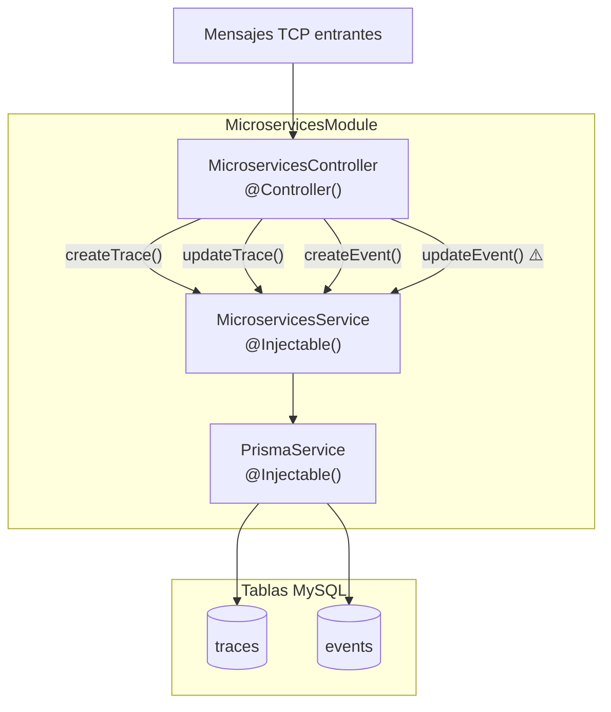

# Módulo: Microservices

> **Ruta/Namespace:** `src/modules/microservices/`
> **Responsable histórico:** ⚠️ Pendiente de verificar
> **Criticidad:** 🔴 Alta
> **Estado:** Activo

## Propósito

Recibe y persiste las **trazas de operaciones GraphQL** (modelo `traces`) y los **eventos de microservicios** (modelo `events`) emitidos por el gateway del ecosistema BCR-Muvin. Cada operación GraphQL genera una traza; cada microservicio llamado durante esa operación genera un evento correlacionado. Esto permite reconstruir el ciclo de vida completo de cualquier request.

## Funcionalidades que expone

| # | Funcionalidad | Descripción breve | Detalle |
|---|---------------|-------------------|---------|
| 1.1 | Crear traza | Registra una nueva operación GraphQL como PENDING | [[microservices-trace-create]] |
| 1.2 | Actualizar traza | Completa la traza con respuesta, status y duración | [[microservices-trace-update]] |
| 1.3 | Crear evento | Registra la llamada de un MS específico vinculada a una traza | [[microservices-event-create]] |
| 1.4 | Actualizar evento | ⚠️ BUG ACTIVO — nunca se invoca por duplicidad de CMD | [[microservices-event-update]] |

## Dependencias

- **Depende de:** `PrismaService`, `@common` (CMDS, LOG), `@contract-ms-logs`
- **Es usado por:** Clientes TCP externos (ms-gateway, otros MS del ecosistema)
- **Consume servicios backend:** No aplica — solo persiste datos

## Diagrama de componentes internos

## Message Patterns (TCP)

| Pattern | Handler | Tipo operación | Devuelve respuesta |
|---------|---------|----------------|-------------------|
| `logs.trace.create` | `createTrace()` | Escritura — fire & forget | ❌ No (`void`) |
| `logs.trace.update` | `updateTrace()` | Escritura — fire & forget | ❌ No (`void`) |
| `logs.event.create` | `createEvent()` | Escritura — fire & forget | ❌ No (`void`) |
| `logs.event.create` ⚠️ | `updateEvent()` | ⚠️ DUPLICADO — nunca se invoca | ❌ No (`void`) |

> 🔴 **BUG CRÍTICO:** El pattern `event.update` está configurado con el string `'logs.event.create'` en lugar de `'logs.event.update'`. Cualquier mensaje enviado como `logs.event.update` nunca llega a `updateEvent()`. Ver `src/common/cmd/constant.ts:17` y [[deuda-tecnica#bug-event-update]].

## Entidades de datos implicadas

[[entidad-traces]], [[entidad-events]]

## Riesgos y deuda técnica detectados

- 🔴 Bug en `event.update` CMD: `'logs.event.create'` duplicado — `updateEvent` nunca se ejecuta (`src/common/cmd/constant.ts:17`)
- ⚠️ Errores en operaciones de escritura se capturan con `console.log` y se descartan silenciosamente — no hay alertas ni reintentos
- ⚠️ `PrismaService` instanciado localmente — coexiste con la instancia del `LegacyModule` (dos conexiones a BD)
- ⚠️ Las operaciones de escritura usan `void this._service.xxx()` — se ignoran las promesas rechazadas en el controller

## Archivos fuente relevantes

- `src/modules/microservices/controller.ts`
- `src/modules/microservices/service.ts`
- `src/modules/microservices/module.ts`
- `src/common/cmd/constant.ts` (definición de patterns — contiene el bug)
- `src/service.ts` (PrismaService compartido)

---

*Ver también: [[modulo-legacy]] · [[entidad-traces]] · [[entidad-events]] · [[flujo-tracing-graphql]] · [[deuda-tecnica]]*
