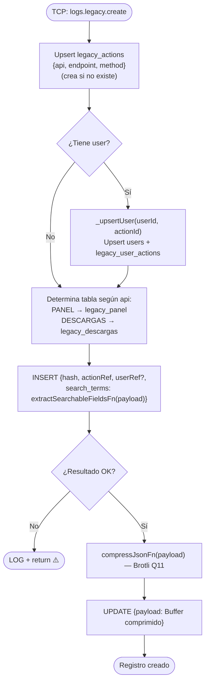

# Funcionalidad: Crear Registro Legacy (legacy.create)

> **Módulo:** [[modulo-legacy]]
> **Pattern TCP:** `logs.legacy.create`
> **Tipo:** Integración — escritura fire & forget

## Descripción funcional

Registra el inicio de un request HTTP realizado contra uno de los sistemas legados (`LEGACY_PANEL` o `LEGACY_DESCARGAS`). El proceso:
1. Crea o recupera la **acción** correspondiente al endpoint+método+api (catálogo de endpoints).
2. Crea o actualiza el **usuario** en el mirror de usuarios (si aplica).
3. Inserta el registro en la tabla correspondiente (`legacy_panel` o `legacy_descargas`).
4. Comprime el payload con Brotli Q11 y lo actualiza en la misma fila.
5. Extrae términos de búsqueda del payload para búsqueda posterior.

La operación usa un **hash** como correlation ID para vincular este registro con la actualización de respuesta que llega después.

## Precondiciones

- `api` debe ser `LEGACY_PANEL` o `LEGACY_DESCARGAS`.
- `hash` debe ser único.
- `endpoint`, `method` son requeridos para catalogar la acción.
- `payload` debe ser un objeto JSON serializable.

## Flujo principal



> ⚠️ El insert y el update del payload comprimido son **dos operaciones separadas**. Hay una ventana de tiempo donde el registro existe sin payload.

## Payload recibido (tipo `TContractMsLogs['legacy-create']`)

```typescript
{
  api: EApi;           // 'LEGACY_PANEL' | 'LEGACY_DESCARGAS'
  hash: string;        // Correlation ID
  endpoint: string;    // Ruta HTTP del endpoint legado (ej: '/api/cupos/123')
  method: EHttpMethod; // 'GET' | 'POST' | 'PUT' | 'DELETE' | 'PATCH'
  payload: unknown;    // Body/params del request HTTP (JSON)
  user?: number;       // ID de usuario (opcional — null si sin auth)
}
```

## Datos que escribe

- **Escribe:** [[entidad-legacy]] (`legacy_panel` o `legacy_descargas`)
- **Upserta:** `legacy_actions` (catálogo de endpoints), `users`, `legacy_user_actions`

## Archivos fuente relevantes

- `src/modules/legacy/service.ts` — `create()` (líneas ~36-101)
- `src/core/utils/json.ts` — `compressJsonFn()`
- `src/core/utils/terms.ts` — `extractSearchableFieldsFn()`

## Riesgos específicos

- ⚠️ Ventana de inconsistencia: entre el INSERT inicial y el UPDATE con payload comprimido, el registro tiene `payload = null`
- ⚠️ Si `compressJsonFn` falla, el registro queda sin payload pero existe en BD
- ⚠️ Error silenciado — si el INSERT falla (ej: hash duplicado), se descarta sin notificación

---

*Ver también: [[legacy-update]] · [[entidad-legacy]] · [[flujo-legacy-logging]]*
