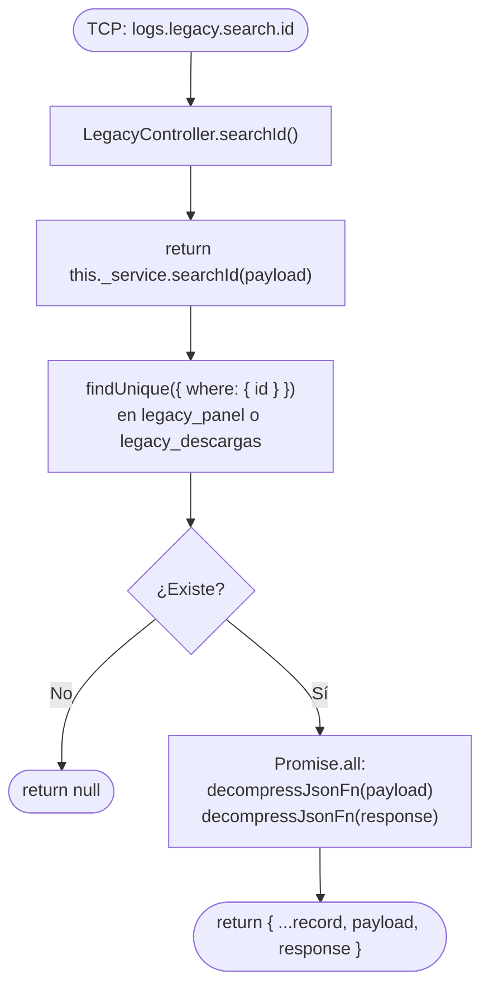

# Funcionalidad: Buscar por ID (legacy.search.id)

> **Módulo:** [[modulo-legacy]]
> **Pattern TCP:** `logs.legacy.search.id`
> **Tipo:** CRUD — lectura puntual con respuesta

## Descripción funcional

Recupera un registro único de `legacy_panel` o `legacy_descargas` identificado por su `id` numérico. Los payloads y responses comprimidos se descomprimen en memoria antes de retornar. Devuelve `null` si el registro no existe.

## Flujo principal



## Payload recibido (tipo `TContractMsLogs['legacy-search-id']`)

```typescript
{
  api: EApi; // 'LEGACY_PANEL' | 'LEGACY_DESCARGAS'
  id: number; // ID primario del registro
}
```

## Respuesta devuelta

```typescript
// Registro completo con payload y response descomprimidos
{
  id: number;
  hash: string;
  user: number | null;
  action: number;
  code: number;
  status: EStatus;
  search_terms: string | null;
  payload: unknown;       // JSON descomprimido
  response: unknown;      // JSON descomprimido (null si pendiente)
  createdAt: Date;
  finishedAt: Date | null;
  duration: number | null;
}
// ó null si no existe
```

## Datos que lee

- **Lee:** [[entidad-legacy]] (`legacy_panel` o `legacy_descargas`)

## Archivos fuente relevantes

- `src/modules/legacy/service.ts` — `searchId()` (líneas ~195-250)
- `src/core/utils/json.ts` — `decompressJsonFn()`

## Riesgos específicos

- ⚠️ La descompresión Brotli es síncrona-asíncrona (`Promise.all`) — si el buffer está corrupto, lanza una excepción que el try/catch del service captura y retorna `null`
- ⚠️ No hay paginación — retorna exactamente uno o null (por diseño, correcto para búsqueda por PK)

---

*Ver también: [[legacy-search-user]] · [[legacy-search-terms]] · [[entidad-legacy]]*
