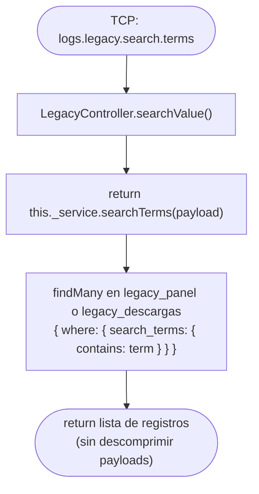

# Funcionalidad: Buscar por Términos (legacy.search.terms)

> **Módulo:** [[modulo-legacy]]
> **Pattern TCP:** `logs.legacy.search.terms`
> **Tipo:** Búsqueda semántica — lectura con respuesta

## Descripción funcional

Realiza una búsqueda full-text sobre el campo `search_terms` de `legacy_panel` o `legacy_descargas`. Los términos de búsqueda son valores de negocio (cupos, CTG, carta de porte, patentes, etc.) que fueron extraídos automáticamente del payload/response en las operaciones de write. La búsqueda usa `LIKE '%term%'` sobre un campo VARCHAR.

## Precondiciones

- `term` debe ser un string no vacío.
- `api` determina en qué tabla buscar.

## Flujo principal



## Payload recibido (tipo `TContractMsLogs['legacy-search-terms']`)

```typescript
{
  api: EApi;   // 'LEGACY_PANEL' | 'LEGACY_DESCARGAS'
  term: string; // Término a buscar en search_terms
}
```

## Respuesta devuelta

Lista de registros con metadata (sin payloads descomprimidos — solo campos indexados):

```typescript
Array<{
  id: number;
  hash: string;
  user: number | null;
  action: number;
  code: number;
  status: EStatus;
  search_terms: string | null;
  createdAt: Date;
  finishedAt: Date | null;
  duration: number | null;
  // payload y response NO se incluyen (quedan como Buffer)
}>
```

> ⚠️ Pendiente de verificar: la selección exacta de campos del `findMany` en `searchTerms()` — el método completo no fue leído.

## Términos de negocio buscables

La búsqueda actúa sobre el campo `search_terms` que contiene valores concatenados de los campos extraídos al momento del write:

| Dato buscable | Ejemplo de valor |
|---------------|-----------------|
| Número de cupo | `C123456` |
| CTG | `12345678` |
| Carta de porte | `CP-987654` |
| CUIT transportista | `20123456789` |
| CUIT chofer | `27987654321` |
| Dominio del camión | `ABC123` |
| Cosecha | `2024/2025` |
| Grano | `maiz` |

## Datos que lee

- **Lee:** [[entidad-legacy]] (`legacy_panel` o `legacy_descargas`)

## Archivos fuente relevantes

- `src/modules/legacy/service.ts` — `searchTerms()` (líneas ~360+ aprox. — 🚧 no leído completo)
- `src/core/utils/terms.ts` — define qué campos se indexan y sus aliases

## Riesgos específicos

- 🟡 Búsqueda con `LIKE '%term%'` no usa índices MySQL eficientemente — puede ser lenta en tablas grandes
- ⚠️ Sin paginación — puede retornar muchos registros si el término es genérico
- ⚠️ Sin límite de resultados (`take`) — posible sobrecarga de memoria con términos frecuentes
- ⚠️ El field `search_terms` es `VARCHAR` — para volúmenes altos se debería considerar MySQL FULLTEXT INDEX o Elasticsearch

---

*Ver también: [[legacy-search-id]] · [[legacy-search-user]] · [[entidad-legacy]] · [[deuda-tecnica]]*
