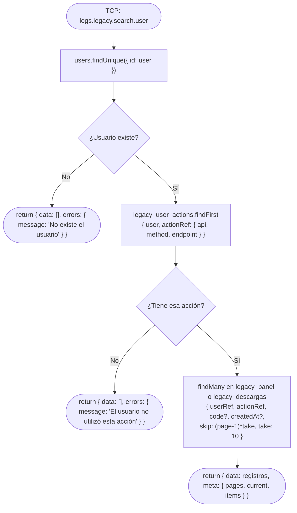

# Funcionalidad: Buscar por Usuario (legacy.search.user)

> **Módulo:** [[modulo-legacy]]
> **Pattern TCP:** `logs.legacy.search.user`
> **Tipo:** CRUD — lectura paginada con respuesta

## Descripción funcional

Lista los registros legacy asociados a un usuario específico para un endpoint+método+api determinado. Verifica que el usuario exista y que haya ejecutado esa acción al menos una vez. Soporta filtros opcionales por fecha y código HTTP, y paginación manual. Los payloads no se descomprimen en este resultado (se retorna `search_terms` y metadata para listados).

## Precondiciones

- El usuario debe existir en la tabla `users`.
- El usuario debe tener al menos una entrada en `legacy_user_actions` para la acción indicada.

## Flujo principal



## Payload recibido (tipo `TContractMsLogs['legacy-search-user']`)

```typescript
{
  api: EApi;           // 'LEGACY_PANEL' | 'LEGACY_DESCARGAS'
  user: number;        // ID del usuario a buscar
  method: EHttpMethod; // Método HTTP del endpoint
  endpoint: string;    // Ruta del endpoint
  createdAt?: Date;    // Filtro opcional por fecha
  code?: number;       // Filtro opcional por código HTTP
  page?: number;       // Página (default: 1)
}
```

## Paginación

| Parámetro | Valor | Fuente |
|-----------|-------|--------|
| `take` (página size) | `10` (fijo) | `private readonly _take = 10` en `LegacyService` |
| `skip` | `(page - 1) * 10` | Calculado en el service |
| `page` default | `1` | `private readonly _skip = 1` ⚠️ nombre confuso |

> ⚠️ El campo `_skip` en el service se llama `_skip` pero almacena el **número de página** inicial (1), no el offset de skip. Naming confuso. Ver [[deuda-tecnica]].

## Estructura de respuesta (éxito)

```typescript
{
  data: Array<{
    id: number;
    code: number;
    createdAt: Date;
    finishedAt: Date | null;
    search_terms: string | null;
  }>;
  meta: {
    pages: number;   // total de páginas
    current: number; // página actual
    items: number;   // total de items
  };
}
```

## Estructura de respuesta (error)

```typescript
{
  data: [];
  errors: { message: string; }
}
// ⚠️ Formato inconsistente con IApiResponse<T>
```

## Datos que lee

- **Lee:** [[entidad-legacy]], [[entidad-users]]

## Archivos fuente relevantes

- `src/modules/legacy/service.ts` — `searchUser()` (líneas ~260-360 aprox.)

## Riesgos específicos

- ⚠️ Formato de respuesta de error (`{ data: [], errors }`) es inconsistente con el contrato `IApiResponse<T>` — puede romper deserialización en clientes
- ⚠️ `_skip` mal nombrado — almacena la página inicial (1), no el offset SQL
- ⚠️ `take = 10` hardcodeado — no es configurable por el caller

---

*Ver también: [[legacy-search-id]] · [[legacy-search-terms]] · [[entidad-legacy]] · [[entidad-users]]*
