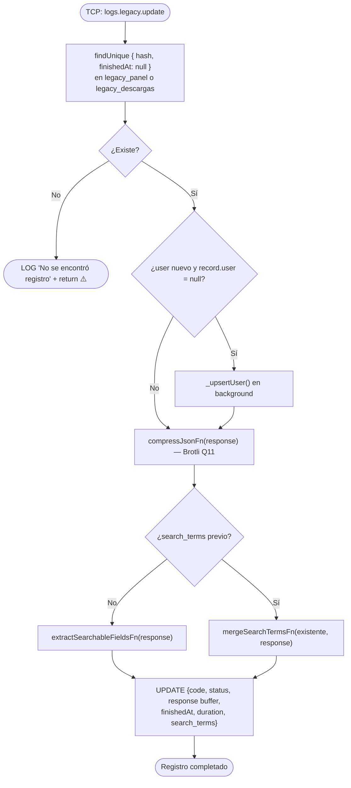

# Funcionalidad: Actualizar Registro Legacy (legacy.update)

> **Módulo:** [[modulo-legacy]]
> **Pattern TCP:** `logs.legacy.update`
> **Tipo:** Integración — escritura fire & forget

## Descripción funcional

Completa el ciclo de vida de un registro legacy previamente creado con `legacy.create`. Recibe la respuesta del sistema legado, la comprime con Brotli, calcula la duración, determina el `status` según el código HTTP y fusiona los términos de búsqueda extraídos de la respuesta con los del payload inicial.

## Precondiciones

- Debe existir un registro con el `hash` dado **y** con `finishedAt = null` (registro abierto).
- `code` debe ser un código HTTP válido (determina el `status` resultante).
- `api` debe coincidir con el del registro original.

## Flujo principal



## Cálculo de `status` según `code` HTTP

```typescript
// Inferido del método _status() en LegacyService
// 2xx → SUCCESS
// 4xx / 5xx → ERROR
// Timeout → TIMEOUT (⚠️ Pendiente de verificar lógica exacta)
```

> ⚠️ La implementación exacta de `_status(code)` no fue leída completa — marcado como 🚧 pendiente de verificar.

## ⚠️ Inconsistencia de unidad en `duration`

```typescript
// En legacy.update:
duration: Math.floor((Date.now() - record.createdAt.getTime()) / 1000)
// → Calcula segundos enteros

// En trace.update:
duration: new Date().getTime() - createdAt.getTime()
// → Calcula milisegundos
```

El campo `duration` en el schema Prisma está documentado como "Total duration in ms" pero `LegacyService.update()` almacena **segundos**. Ver [[deuda-tecnica]].

## Payload recibido (tipo `TContractMsLogs['legacy-update']`)

```typescript
{
  api: EApi;           // 'LEGACY_PANEL' | 'LEGACY_DESCARGAS'
  hash: string;        // Correlation ID del registro a actualizar
  response: unknown;   // Respuesta del sistema legado (JSON)
  code: number;        // Código HTTP de la respuesta
  user?: number;       // ID de usuario (se puede resolver tardíamente)
}
```

## Datos que modifica

- **Modifica:** [[entidad-legacy]] (`legacy_panel` o `legacy_descargas`)
- **Puede upsartar:** `users`, `legacy_user_actions` (si `user` llega en el update pero no en el create)

## Archivos fuente relevantes

- `src/modules/legacy/service.ts` — `update()` (líneas ~103-175)
- `src/core/utils/json.ts` — `compressJsonFn()`
- `src/core/utils/terms.ts` — `mergeSearchTermsFn()`

## Riesgos específicos

- 🔴 `duration` se almacena en segundos pero el schema dice "ms" — incompatibilidad entre módulos del mismo MS
- ⚠️ Si el registro ya fue actualizado (`finishedAt != null`), un segundo `update` es descartado silenciosamente
- ⚠️ `_upsertUser()` se llama con `void` en background — si falla, no hay registro del error

---

*Ver también: [[legacy-create]] · [[entidad-legacy]] · [[deuda-tecnica]]*
