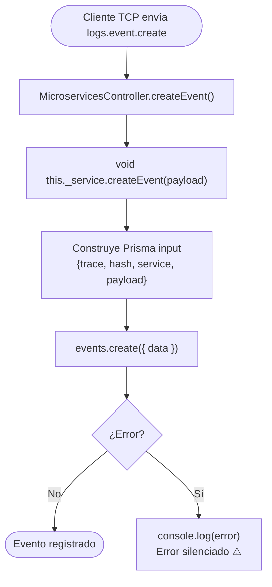

# Funcionalidad: Crear Evento (event.create)

> **Módulo:** [[modulo-microservices]]
> **Pattern TCP:** `logs.event.create`
> **Tipo:** Integración — escritura fire & forget

## Descripción funcional

Registra la llamada realizada por el gateway a un **microservicio específico** dentro del contexto de una operación GraphQL. Cada evento queda vinculado a una traza mediante el campo `trace` (que contiene el `hash` de la traza padre). El campo `hash` del evento es un correlation ID propio (distinto al de la traza) que permite identificar la respuesta de ese microservicio específico.

## Precondiciones

- Debe existir (o estar en proceso de creación) una traza con el `hash` = valor de `trace` del evento.
- `hash` del evento debe ser único en la tabla `events`.
- `service` identifica el nombre del microservicio llamado (ej: `"ms-legacy"`).
- `payload` es el mensaje enviado al MS.

## Flujo principal



## Payload recibido (tipo `TContractMsLogs['event-create']`)

```typescript
{
  trace: string;   // hash de la traza padre (VarChar 50)
  hash: string;    // correlation ID propio del evento (VarChar 50)
  service: string; // nombre del microservicio llamado (VarChar 30)
  payload: unknown; // mensaje enviado al MS (JSON)
}
```

## Estado resultante en BD

| Campo | Valor al crear |
|-------|---------------|
| `trace` | hash de la traza padre |
| `hash` | correlation ID del evento |
| `service` | nombre del MS |
| `payload` | JSON del mensaje |
| `response` | `null` |
| `duration` | `null` |
| `finishedAt` | `null` |
| `createdAt` | `NOW()` |

## Datos que escribe

- **Escribe:** [[entidad-events]]
- **Relacionado con:** [[entidad-traces]] (via campo `trace`)

## Archivos fuente relevantes

- `src/modules/microservices/service.ts` — `createEvent()` (líneas ~57-68)
- `src/contracts/ms-logs/contract.ts` — tipo `TEventCreate`
- `src/common/cmd/constant.ts` — `CMDS.logs.event.create = 'logs.event.create'`

## Riesgos específicos

- ⚠️ No se valida que la traza referenciada exista — el campo `trace` es solo `VARCHAR`, sin FK en BD
- ⚠️ Error silenciado en caso de hash duplicado

---

*Ver también: [[microservices-event-update]] · [[microservices-trace-create]] · [[entidad-events]]*
