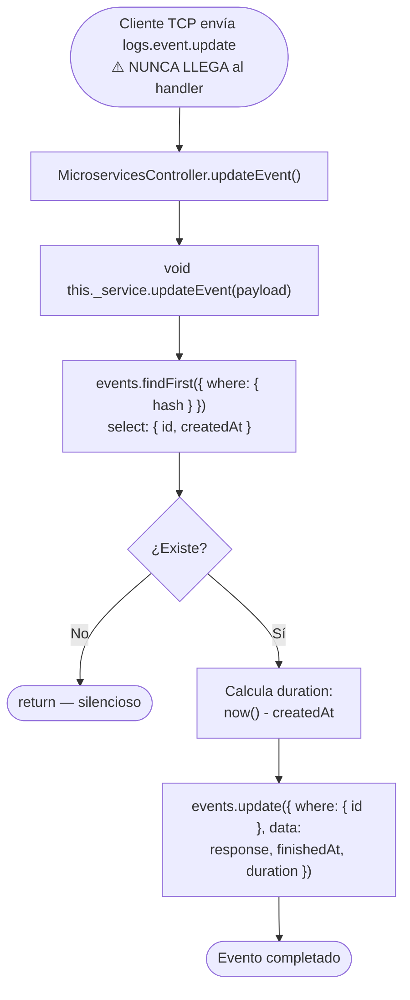

# Funcionalidad: Actualizar Evento (event.update)

> **Módulo:** [[modulo-microservices]]
> **Pattern TCP:** `logs.event.update` (⚠️ BUG — configurado como `logs.event.create`)
> **Tipo:** Integración — escritura fire & forget

> [!danger] Riesgo de seguridad / integridad
> **Esta funcionalidad está rota.** El message pattern definido en `src/common/cmd/constant.ts` para `event.update` tiene el valor `'logs.event.create'` en lugar de `'logs.event.update'`. Como consecuencia:
> - Ningún mensaje enviado con el patrón `logs.event.update` llegará a este handler.
> - Los eventos **nunca se actualizan** con su respuesta final ni duración.
> - La tabla `events` siempre tendrá `response = null` y `duration = null` para todos los registros.
> - Ver [[deuda-tecnica#bug-event-update]] para el fix.

## Descripción funcional (diseño original)

Debería completar el ciclo de vida de un evento de microservicio, actualizando su respuesta, duración y timestamp de finalización. El flujo es análogo a [[microservices-trace-update]] pero sobre la tabla `events`.

## Flujo principal (diseño — no ejecutable en el estado actual)



## Payload recibido (tipo `TContractMsLogs['event-update']`)

```typescript
{
  hash: string;    // correlation ID del evento a actualizar
  trace: string;   // hash de la traza padre (redundante — no se usa en el where)
  response: unknown; // respuesta recibida del MS (JSON)
}
```

## Fix requerido

**Archivo:** `src/common/cmd/constant.ts`
**Línea:** 17 (aproximada)

```typescript
// ESTADO ACTUAL (buggy):
event: {
  create: 'logs.event.create',
  update: 'logs.event.create',  // ← BUG: duplicado
}

// CORRECCIÓN:
event: {
  create: 'logs.event.create',
  update: 'logs.event.update',  // ← Fix
}
```

## Impacto del bug

| Afectado | Impacto |
|----------|---------|
| Tabla `events` | `response` y `duration` son siempre `null` — datos de auditoría incompletos |
| Observabilidad | No se puede saber qué respondió cada MS ni cuánto tardó |
| Trazabilidad | El ciclo de vida del evento queda abierto — `finishedAt` nunca se setea |

---

*Ver también: [[microservices-event-create]] · [[entidad-events]] · [[deuda-tecnica]]*
