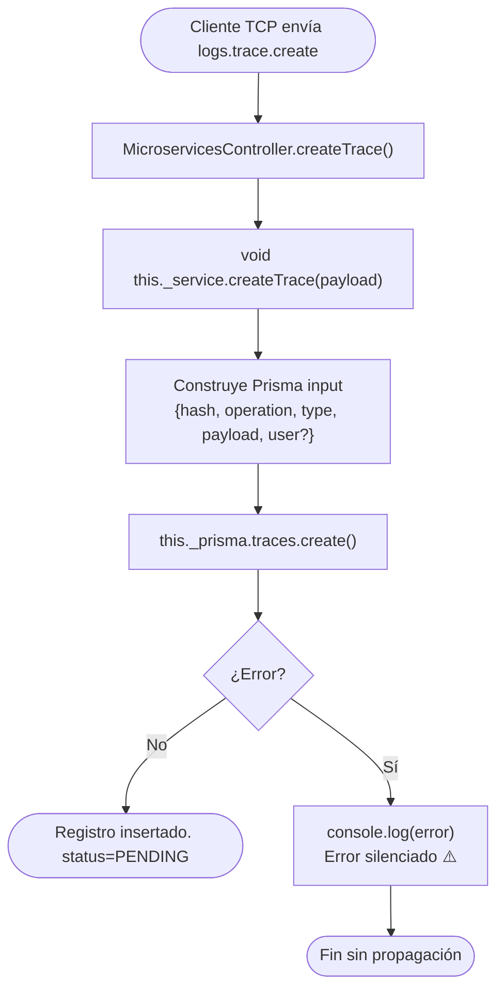

# Funcionalidad: Crear Traza (trace.create)

> **Módulo:** [[modulo-microservices]]
> **Pattern TCP:** `logs.trace.create`
> **Tipo:** Integración — escritura fire & forget

## Descripción funcional

Registra el **inicio de una operación GraphQL** en la tabla `traces`. El registro se crea con `status = PENDING` y sin `response`. El caller (gateway) envía el mensaje y no espera respuesta. La traza se identifica de manera única por su `hash` (correlation ID), que permite vincularla posteriormente con eventos de microservicios y con la actualización final.

## Precondiciones

- El `hash` debe ser globalmente único (generado por el interceptor del gateway).
- El `operation` debe ser un string no vacío de hasta 200 caracteres.
- `type` debe ser `QUERY` o `MUTATION` (enum `EGraphQlOperation`).
- `payload` debe ser un objeto JSON serializable.
- `user` es opcional (puede ser `null` si la operación no tiene autenticación).

## Flujo principal



## Flujos alternativos / excepciones

- **Hash duplicado:** MySQL rechaza la inserción (`UNIQUE` sobre `hash`). El error es capturado silenciosamente con `console.log`. No hay reintento ni notificación. 🔴

## Validaciones de negocio

| Validación | Dónde | Nota |
|------------|-------|------|
| `whitelist: true` sobre el payload | `ValidationPipe` global | Elimina campos no declarados |
| `forbidNonWhitelisted: true` | `ValidationPipe` global | Rechaza mensajes con campos extra |
| `hash` único en BD | Constraint MySQL `UNIQUE INDEX traces_hash_key` | Error silenciado si duplicado |

## Payload recibido (tipo `TContractMsLogs['trace-create']`)

```typescript
{
  hash: string;        // Correlation ID — VarChar(50)
  operation: string;   // Nombre de la operación GraphQL — VarChar(200)
  type: EGraphQlOperation; // 'QUERY' | 'MUTATION'
  payload: unknown;    // Cuerpo del request GraphQL (JSON)
  user?: number;       // ID de usuario — null si sin auth
}
```

## Estado resultante en BD

| Campo | Valor al crear |
|-------|---------------|
| `hash` | Valor recibido |
| `operation` | Valor recibido |
| `type` | Valor recibido |
| `payload` | JSON del request |
| `user` | `number` o `null` |
| `status` | `PENDING` (default BD) |
| `response` | `null` |
| `duration` | `null` |
| `finishedAt` | `null` |
| `createdAt` | `NOW()` |

## Datos que escribe

- **Escribe:** [[entidad-traces]]

## Archivos fuente relevantes

- `src/modules/microservices/controller.ts` — `createTrace()` (líneas ~18-22)
- `src/modules/microservices/service.ts` — `createTrace()` (líneas ~13-25)
- `src/contracts/ms-logs/contract.ts` — tipo `TTraceCreate`
- `src/common/cmd/constant.ts` — `CMDS.logs.trace.create = 'logs.trace.create'`

## Riesgos específicos

- 🔴 Errores de BD capturados silenciosamente — se pierde el log sin notificación
- ⚠️ Si el gateway envía `hash` duplicado (error de generación), el segundo insert falla silenciosamente y la traza queda sin registro

---

*Ver también: [[microservices-trace-update]] · [[microservices-event-create]] · [[entidad-traces]] · [[flujo-tracing-graphql]]*
