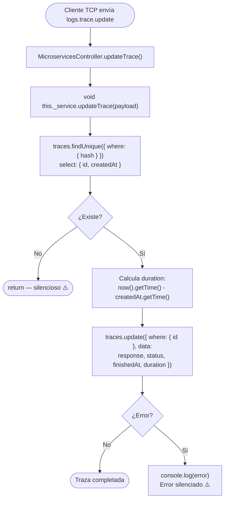

# Funcionalidad: Actualizar Traza (trace.update)

> **Módulo:** [[modulo-microservices]]
> **Pattern TCP:** `logs.trace.update`
> **Tipo:** Integración — escritura fire & forget

## Descripción funcional

Completa el ciclo de vida de una traza GraphQL previamente creada. Recibe el `hash` de la traza, la respuesta final y el status de la operación. Calcula automáticamente la duración (`finishedAt - createdAt`) y actualiza el registro en BD. Si no existe ninguna traza con ese `hash`, la operación termina silenciosamente.

## Precondiciones

- Debe existir una traza con el `hash` indicado (creada previamente con `trace.create`).
- `status` debe ser `SUCCESS`, `ERROR` o `TIMEOUT` (el valor `PENDING` queda reservado para el estado inicial).
- `response` puede ser cualquier objeto JSON.

## Flujo principal



## Payload recibido (tipo `TContractMsLogs['trace-update']`)

```typescript
{
  hash: string;     // Correlation ID — identifica la traza a actualizar
  response: unknown; // Cuerpo de la respuesta GraphQL (JSON)
  status: EStatus;  // 'SUCCESS' | 'ERROR' | 'TIMEOUT'
}
```

## Estado resultante en BD (campos modificados)

| Campo | Valor al actualizar |
|-------|-------------------|
| `response` | JSON de la respuesta |
| `status` | `SUCCESS` / `ERROR` / `TIMEOUT` |
| `finishedAt` | `new Date()` al momento del update |
| `duration` | `finishedAt.getTime() - createdAt.getTime()` (en **ms**) |

## Datos que modifica

- **Modifica:** [[entidad-traces]]

## Archivos fuente relevantes

- `src/modules/microservices/service.ts` — `updateTrace()` (líneas ~27-55)
- `src/contracts/ms-logs/contract.ts` — tipo `TTraceUpdate`
- `src/common/cmd/constant.ts` — `CMDS.logs.trace.update = 'logs.trace.update'`

## Riesgos específicos

- ⚠️ Si la traza no existe (hash no encontrado), la operación termina silenciosamente — no hay error ni log
- ⚠️ Condición de carrera posible: si `trace.update` llega antes que `trace.create` procese, la traza no existe aún y la actualización se descarta

---

*Ver también: [[microservices-trace-create]] · [[microservices-event-update]] · [[entidad-traces]]*
