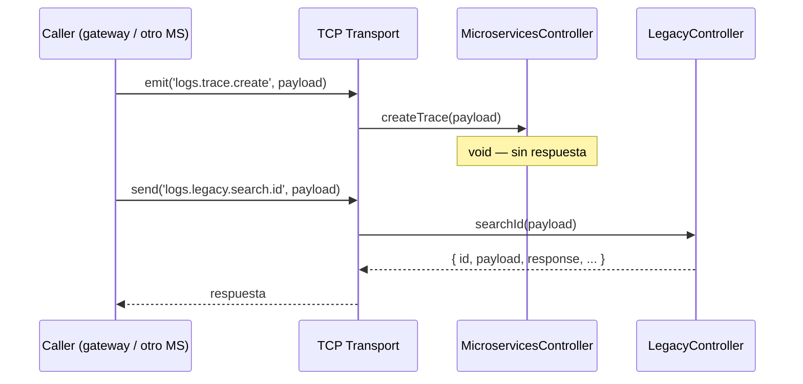

# Message Patterns — Referencia completa

> **Contexto:** [[_indice-servicios]] · [[arquitectura-alto-nivel]]
> **Protocolo:** TCP (NestJS Microservices)
> **Host/Port:** `LOGS_MICROSERVICE_HOST` / `LOGS_MICROSERVICE_PORT`

## Patrón de comunicación

Todos los patrones usan `ClientProxy.emit()` (fire & forget) o `ClientProxy.send()` (request-response) desde el caller. Los patrones de escritura son siempre `emit`, los de lectura pueden ser `send`.



---

## Grupo 1: Traces (trazas GraphQL)

### `logs.trace.create`

| Ítem | Valor |
|------|-------|
| Módulo | [[modulo-microservices]] |
| Handler | `MicroservicesController.createTrace()` |
| Tipo | Fire & forget (`emit`) |
| Respuesta | void |

**Payload:**
```typescript
{
  hash: string;           // Correlation ID único
  operation: string;      // Nombre de la operación GraphQL
  type: 'QUERY' | 'MUTATION';
  payload: unknown;       // Body del request
  user?: number;          // ID de usuario (opcional)
}
```

---

### `logs.trace.update`

| Ítem | Valor |
|------|-------|
| Módulo | [[modulo-microservices]] |
| Handler | `MicroservicesController.updateTrace()` |
| Tipo | Fire & forget (`emit`) |
| Respuesta | void |

**Payload:**
```typescript
{
  hash: string;           // Correlation ID de la traza a cerrar
  response: unknown;      // Body de la respuesta GraphQL
  status: EStatus;        // 'SUCCESS' | 'ERROR' | 'TIMEOUT'
}
```

---

## Grupo 2: Events (eventos de microservicio)

### `logs.event.create`

| Ítem | Valor |
|------|-------|
| Módulo | [[modulo-microservices]] |
| Handler | `MicroservicesController.createEvent()` |
| Tipo | Fire & forget (`emit`) |
| Respuesta | void |

**Payload:**
```typescript
{
  trace: string;   // Hash de la traza padre
  hash: string;    // Correlation ID del evento
  service: string; // Nombre del MS llamado
  payload: unknown; // Mensaje enviado al MS
}
```

---

### `logs.event.update` 🔴 BUG

| Ítem | Valor |
|------|-------|
| Módulo | [[modulo-microservices]] |
| Handler | `MicroservicesController.updateEvent()` |
| Tipo | Fire & forget (`emit`) |
| Respuesta | void |
| Estado | 🔴 **NUNCA INVOCADO** — CMD configurado como `logs.event.create` |

**Payload:**
```typescript
{
  hash: string;    // Correlation ID del evento a cerrar
  trace: string;   // Hash de la traza padre
  response: unknown; // Respuesta del MS
}
```

> Ver [[microservices-event-update]] para detalle del bug y fix.

---

## Grupo 3: Legacy (operaciones HTTP legadas)

### `logs.legacy.create`

| Ítem | Valor |
|------|-------|
| Módulo | [[modulo-legacy]] |
| Handler | `LegacyController.create()` |
| Tipo | Fire & forget (`emit`) |
| Respuesta | void |

**Payload:**
```typescript
{
  api: 'LEGACY_PANEL' | 'LEGACY_DESCARGAS';
  hash: string;
  endpoint: string;
  method: 'GET' | 'POST' | 'PUT' | 'DELETE' | 'PATCH';
  payload: unknown;
  user?: number;
}
```

---

### `logs.legacy.update`

| Ítem | Valor |
|------|-------|
| Módulo | [[modulo-legacy]] |
| Handler | `LegacyController.update()` |
| Tipo | Fire & forget (`emit`) |
| Respuesta | void |

**Payload:**
```typescript
{
  api: 'LEGACY_PANEL' | 'LEGACY_DESCARGAS';
  hash: string;
  response: unknown;
  code: number;        // Código HTTP de la respuesta
  user?: number;
}
```

---

### `logs.legacy.search.id`

| Ítem | Valor |
|------|-------|
| Módulo | [[modulo-legacy]] |
| Handler | `LegacyController.searchId()` |
| Tipo | Request-response (`send`) |
| Respuesta | `TLogLegacy \| null` |

**Payload:**
```typescript
{
  api: 'LEGACY_PANEL' | 'LEGACY_DESCARGAS';
  id: number;
}
```

---

### `logs.legacy.search.user`

| Ítem | Valor |
|------|-------|
| Módulo | [[modulo-legacy]] |
| Handler | `LegacyController.searchUser()` |
| Tipo | Request-response (`send`) |
| Respuesta | `IApiResponse<TLogLegacy[]>` con paginación |

**Payload:**
```typescript
{
  api: 'LEGACY_PANEL' | 'LEGACY_DESCARGAS';
  user: number;
  method: 'GET' | 'POST' | 'PUT' | 'DELETE' | 'PATCH';
  endpoint: string;
  createdAt?: Date;
  code?: number;
  page?: number;
}
```

---

### `logs.legacy.search.terms`

| Ítem | Valor |
|------|-------|
| Módulo | [[modulo-legacy]] |
| Handler | `LegacyController.searchTerms()` |
| Tipo | Request-response (`send`) |
| Respuesta | `TLogLegacy[]` (sin payload/response descomprimidos) |

**Payload:**
```typescript
{
  api: 'LEGACY_PANEL' | 'LEGACY_DESCARGAS';
  term: string;
}
```

---

*Ver también: [[_indice-funcionalidades]] · [[arquitectura-alto-nivel]] · [[cross-module-dependencies]]*
