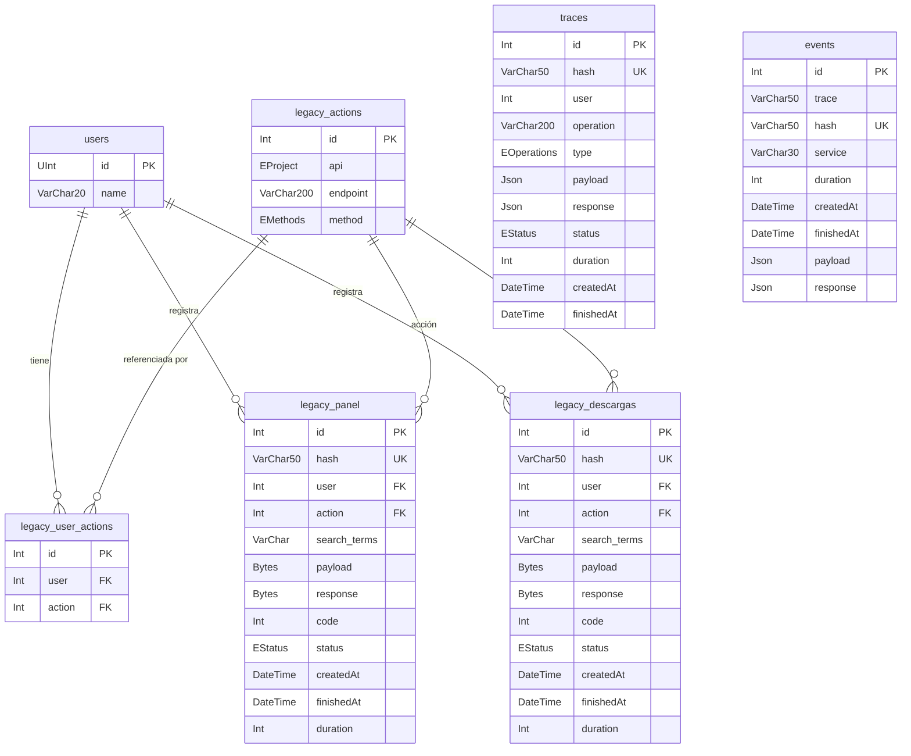

# Índice: Modelo de Datos

> **Contexto:** [[arquitectura-alto-nivel]] · [[_indice-servicios]]

## Resumen

`ms-logs` usa MySQL 8.0 a través de Prisma ORM con **7 modelos** (tablas) y **4 enums**.

## Diagrama ER global

> ℹ️ `events.trace` es un `VARCHAR(50)` que referencia `traces.hash` — **sin FK declarada en BD**. La integridad referencial es responsabilidad de la aplicación.

## Entidades detalladas

| Entidad | Archivo | Descripción |
|---------|---------|-------------|
| [[entidad-traces]] | `prisma/schema.prisma` | Trazas de operaciones GraphQL |
| [[entidad-events]] | `prisma/schema.prisma` | Eventos de llamadas a microservicios |
| [[entidad-users]] | `prisma/schema.prisma` | Mirror de usuarios del sistema |
| [[entidad-legacy]] | `prisma/schema.prisma` | Logs de requests a sistemas legados (panel + descargas) |

---

*Ver también: [[diagrama-er-global]] · [[arquitectura-alto-nivel]]*
