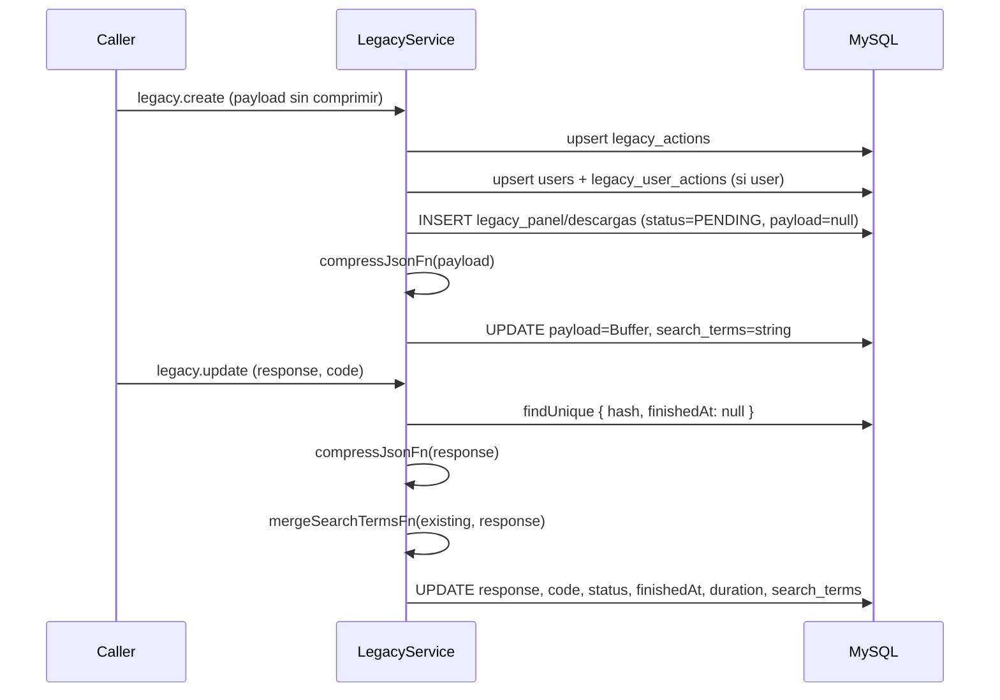

# Entidad: Legacy (panel + descargas)

> **Contexto:** [[_indice-entidades]] · [[modulo-legacy]]
> **Tablas MySQL:** `legacy_panel`, `legacy_descargas`, `legacy_actions`, `legacy_user_actions`
> **Propósito:** Almacenamiento de logs de requests a los sistemas legados PANEL y DESCARGAS

## Resumen de tablas

| Tabla | Propósito |
|-------|-----------|
| `legacy_panel` | Logs de requests al sistema `LEGACY_PANEL` |
| `legacy_descargas` | Logs de requests al sistema `LEGACY_DESCARGAS` |
| `legacy_actions` | Catálogo de endpoints únicos (api + endpoint + method) |
| `legacy_user_actions` | Relación usuario ↔ acción (registro de qué usuarios usaron qué endpoints) |

## `legacy_panel` / `legacy_descargas` — Estructura compartida

Ambas tablas tienen **estructura idéntica**. Se separan físicamente por sistema de origen.

| Campo | Tipo | Nullable | Descripción |
|-------|------|----------|-------------|
| `id` | INT | No | PK autoincremental |
| `hash` | VARCHAR(50) | No | Correlation ID (UNIQUE) |
| `user` | INT? | Sí | FK → `users.id` (nullable) |
| `action` | INT | No | FK → `legacy_actions.id` |
| `search_terms` | VARCHAR | Sí | Términos indexables extraídos del payload/response |
| `payload` | Bytes | No | Payload comprimido con Brotli Q11 |
| `response` | Bytes? | Sí | Response comprimida con Brotli Q11 (null hasta update) |
| `code` | INT | No | Código HTTP de la respuesta |
| `status` | EStatus | No | `PENDING` / `SUCCESS` / `ERROR` / `TIMEOUT` |
| `createdAt` | DATETIME | No | Timestamp de creación |
| `finishedAt` | DATETIME? | Sí | Timestamp de finalización |
| `duration` | INT? | Sí | ⚠️ Duración en **segundos** (inconsistente con traces en ms) |

### Índices en `legacy_panel` y `legacy_descargas`

| Índice | Campos |
|--------|--------|
| `hash` | UNIQUE |
| `user + createdAt` | compuesto |
| `action + createdAt` | compuesto |
| `status + createdAt` | compuesto |
| `code + createdAt` | compuesto |

## `legacy_actions` — Catálogo de endpoints

| Campo | Tipo | Descripción |
|-------|------|-------------|
| `id` | INT | PK |
| `api` | EProject | `LEGACY_PANEL` o `LEGACY_DESCARGAS` |
| `endpoint` | VARCHAR(200) | Ruta del endpoint HTTP |
| `method` | EMethods | `GET` / `POST` / etc. |

**Restricción única:** `(api, endpoint, method)` — no puede haber dos acciones con los mismos tres valores.

## `legacy_user_actions` — Relación usuario ↔ acción

| Campo | Tipo | Descripción |
|-------|------|-------------|
| `id` | INT | PK |
| `user` | INT | FK → `users.id` |
| `action` | INT | FK → `legacy_actions.id` |

**Restricción única:** `(user, action)` — un usuario puede tener una acción registrada una sola vez.

## Enums

| Enum | Valores |
|------|---------|
| `EProject` | `LEGACY_PANEL`, `LEGACY_DESCARGAS` |
| `EStatus` | `PENDING`, `SUCCESS`, `ERROR`, `TIMEOUT` |
| `EMethods` | `GET`, `POST`, `PUT`, `DELETE`, `PATCH` |

## Ciclo de vida de un registro legacy

## Notas críticas

- ⚠️ `duration` se almacena en **segundos** en legacy, pero en **ms** en traces/events — inconsistencia de unidad
- ⚠️ Ventana de inconsistencia: entre INSERT y UPDATE del payload comprimido, el registro existe sin payload

---

*Ver también: [[entidad-users]] · [[legacy-create]] · [[legacy-update]] · [[legacy-search-user]] · [[legacy-search-terms]]*
