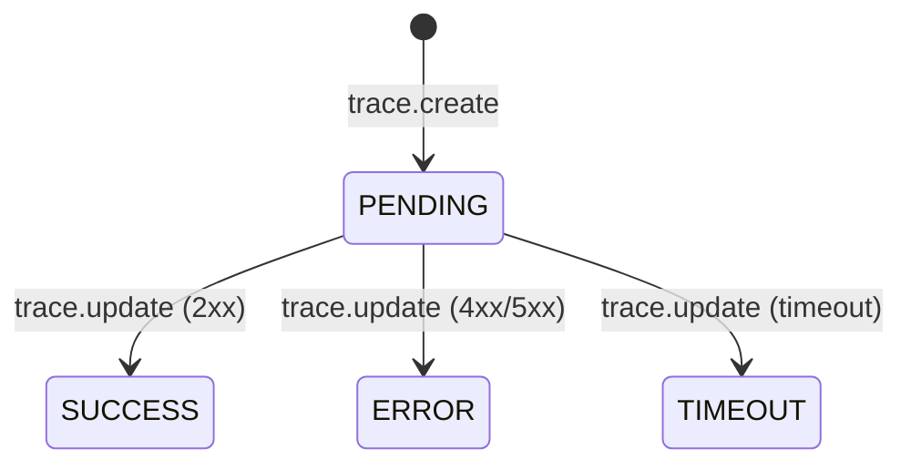

# Entidad: traces

> **Contexto:** [[_indice-entidades]] · [[modulo-microservices]]
> **Tabla MySQL:** `traces`
> **Propósito:** Registro del ciclo de vida de operaciones GraphQL

## Campos

| Campo | Tipo Prisma | Tipo MySQL | Nullable | Default | Descripción |
|-------|-------------|------------|----------|---------|-------------|
| `id` | `Int` | INT | No | auto | PK |
| `hash` | `String` | VARCHAR(50) | No | — | Correlation ID único (UK) |
| `user` | `Int?` | INT | Sí | null | ID de usuario (no FK) |
| `operation` | `String` | VARCHAR(200) | No | — | Nombre de la operación GraphQL |
| `type` | `EOperations` | ENUM | No | — | `QUERY` o `MUTATION` |
| `payload` | `Json` | JSON | No | — | Body del request GraphQL |
| `response` | `Json?` | JSON | Sí | null | Body de la respuesta (null hasta update) |
| `status` | `EStatus` | ENUM | No | `PENDING` | Estado del ciclo de vida |
| `duration` | `Int?` | INT | Sí | null | Duración en **ms** (null hasta update) |
| `createdAt` | `DateTime` | DATETIME | No | `now()` | Timestamp de creación |
| `finishedAt` | `DateTime?` | DATETIME | Sí | null | Timestamp de finalización |

## Enums usados

| Enum | Valores |
|------|---------|
| `EOperations` | `QUERY`, `MUTATION` |
| `EStatus` | `PENDING`, `SUCCESS`, `ERROR`, `TIMEOUT` |

## Índices

| Índice | Campos | Tipo |
|--------|--------|------|
| `traces_hash_key` | `hash` | UNIQUE |
| `traces_user_createdAt_idx` | `user`, `createdAt` | índice compuesto |
| `traces_createdAt_idx` | `createdAt` | índice simple |
| `traces_status_createdAt_idx` | `status`, `createdAt` | índice compuesto |

## Ciclo de vida

## Relaciones

- `traces.hash` ← referenciado por `events.trace` (sin FK en BD)

## Notas de integridad

- El campo `user` no tiene FK declarada — si el usuario se elimina, las trazas quedan huérfanas silenciosamente.
- No hay restricción que garantice que `finishedAt > createdAt`.

---

*Ver también: [[entidad-events]] · [[microservices-trace-create]] · [[microservices-trace-update]]*
