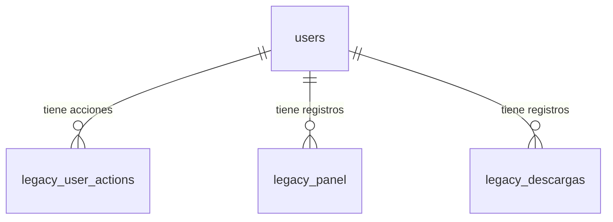

# Entidad: users

> **Contexto:** [[_indice-entidades]] · [[modulo-legacy]]
> **Tabla MySQL:** `users`
> **Propósito:** Mirror de usuarios del sistema principal para relacionar logs con identidades

## Descripción

La tabla `users` no es la tabla de usuarios principal del sistema — es un **mirror local** que se popula automáticamente cuando un request legacy incluye un `user` ID. Los datos se upsartan con `updateOrCreate`, almacenando el ID y opcionalmente el nombre del usuario.

## Campos

| Campo | Tipo Prisma | Tipo MySQL | Nullable | Descripción |
|-------|-------------|------------|----------|-------------|
| `id` | `Int @db.UnsignedInt` | INT UNSIGNED | No | ID del usuario (mismo que sistema origen, UNIQUE) |
| `name` | `String?` | VARCHAR(20) | Sí | Nombre (puede quedar null si no se provee) |

> ℹ️ `id` no es `@id` en el sentido autoincremental — es el ID externo del sistema. Se marca con `@unique`.

## Relaciones

## Notas de diseño

- No hay FK desde `traces.user` → `users.id` — las trazas pueden referir usuarios que no existen en este mirror
- El upsert en `LegacyService` usa `createOrUpdate` con `where: { id }` — es idempotente
- `name` es `VARCHAR(20)` — nombres largos serán truncados silenciosamente por MySQL si no hay validación

## Riesgos

- ⚠️ Sin FK desde `traces` — integridad referencial solo por convención
- ⚠️ `name` limitado a 20 caracteres — potencial truncación sin error

---

*Ver también: [[entidad-legacy]] · [[legacy-create]] · [[legacy-search-user]]*
